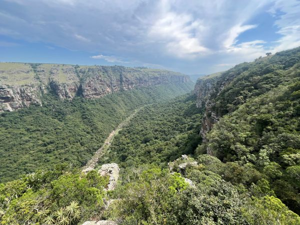
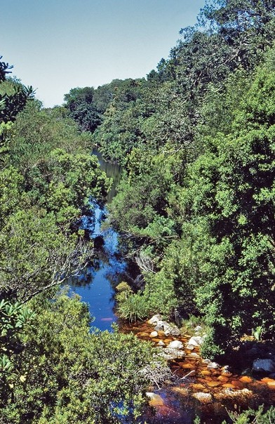
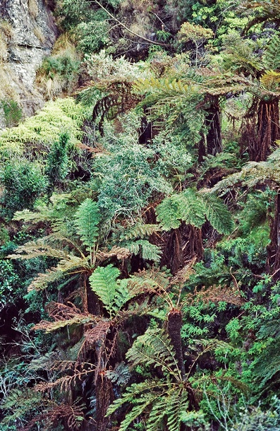
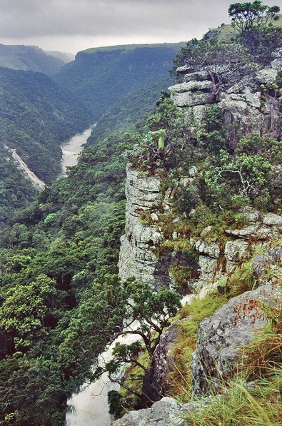
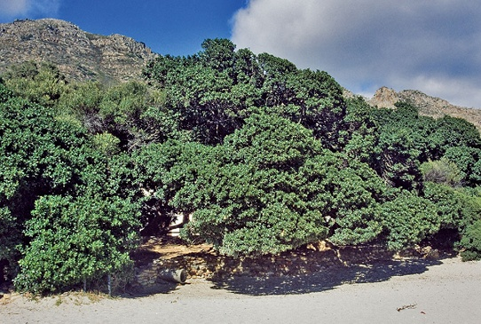
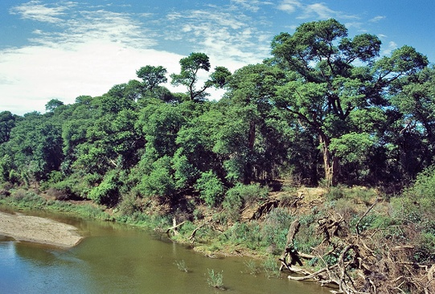
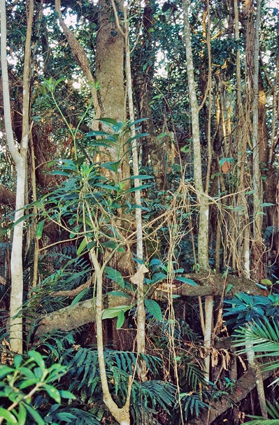
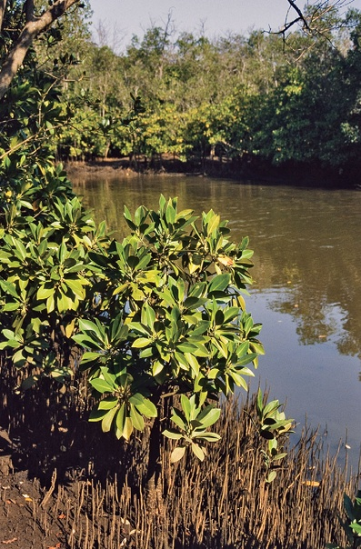
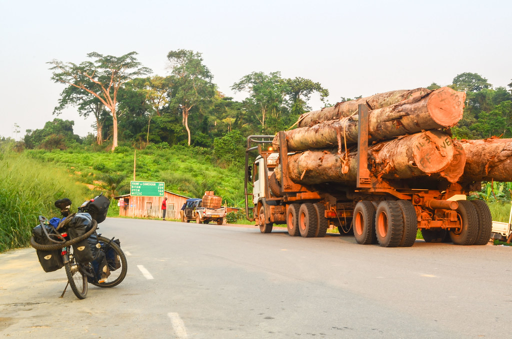

::: callout-note
The ecosystem condition assessments for this biome are still in progress. We thus provide the summary of the vegetation units, what data is currently available that may inform condition assessments or potential approaches.
:::

# Ecological Context

South Africa’s forest biome is the smallest biome in the country, covering less than 1% of the national land surface. Forests occur as naturally fragmented patches embedded within surrounding biomes such as Grassland, Savanna, Thicket, and Fynbos, typically occupying fire-protected refugia such as steep ravines, south-facing slopes, and moist valleys. Forest ecosystems are generally characterised by evergreen, multilayered vegetation dominated by tall trees, with variation in structure, composition, and environmental setting across the country.

Forest distribution and dynamics are strongly shaped by climate, topography, hydrology, and disturbance regimes, particularly fire. Many forest vegetation types persist only where fire penetration is naturally limited, making them highly sensitive to changes in surrounding land use and fire frequency. The biome also contains several highly specialised forest systems associated with coastal dunes, wetlands, river systems, and estuaries.

{width="725"}

# Vegetation units

## Afrotemperate Forests

Afrotemperate forests occur mainly along the escarpment and mountain regions of the Western Cape, Eastern Cape, KwaZulu-Natal, Mpumalanga, and Limpopo. These forests are dominated by evergreen broad-leaved species, including yellowwoods (*Podocarpus* spp.), and are often associated with steep, inaccessible terrain. Northern Afrotemperate forests are generally smaller and more fragmented than Southern Afrotemperate forests.

{fig-align="center"}

## Mistbelt Forests

Mistbelt forests occur along moist escarpment regions in KwaZulu-Natal, Eastern Cape, Mpumalanga, and Limpopo. They are strongly associated with high rainfall and frequent mist and are embedded largely within Grassland and Savanna matrices. These forests support tall evergreen canopies with rich species diversity and are important refugia for forest-dependent fauna.

{fig-align="center"}

## Scarp Forests

Scarp forests occur along humid coastal escarpments and deep gorges of the Eastern Cape and KwaZulu-Natal. They represent transitional systems between Afrotemperate and Coastal forests and are characterised by tall multilayered vegetation with high species richness. Many scarp forests are vulnerable to invasive alien plants and edge-related disturbance.

{fig-align="center"}

## Coastal Forests

Coastal forests occur along the Indian Ocean Coastal Belt, mainly in KwaZulu-Natal and the Eastern Cape. They are species-rich, multilayered forests associated with coastal plains, dune systems, and lowland areas, and are often threatened by agriculture, urban development, invasive alien plants, and fragmentation.

{width="690"}

## Sand Forests

Sand forests are highly specialised dry forests restricted mainly to Maputaland and ancient coastal sands. They support many endemic species and have sharp ecological boundaries, but are highly sensitive to fire, clearing, and disturbance.

## Lowveld Riverine Forests

Riverine forests occur along major rivers and drainage lines, where their distribution is strongly controlled by hydrology and alluvial soils. Their condition depends on maintaining natural flow regimes, riparian connectivity, and limited disturbance from clearing, grazing, invasive plants, and water abstraction.

{width="720"}

## Swamp Forests

Swamp forests are associated with permanently or seasonally waterlogged lowland areas, especially along the subtropical coastal belt. They are shaped by groundwater and surface-water dynamics, making them sensitive to drainage, altered hydrology, invasive species, and surrounding land-use change.

{fig-align="center"}

## Mangrove Forests

Mangrove forests occur in estuarine and tidal environments along the subtropical coastline, especially in KwaZulu-Natal and the Eastern Cape. These saline-adapted forests provide important coastal protection and nursery habitat, but are vulnerable to estuary modification, altered freshwater flows, pollution, harvesting, and coastal development.

{fig-align="center"}

# Key pressures

## Logging and forest exploitation

Historical logging and ongoing forest exploitation have significantly altered forest structure and composition. Selective removal of large canopy trees reduces canopy height, biomass, and habitat complexity, while promoting secondary forest development dominated by disturbance-tolerant species. Informal harvesting for fuelwood, medicinal bark, poles, and construction materials remains an important pressure in many rural forests.

{width="699"}

## Fire regime disruption

Forest distribution in South Africa is tightly linked to fire dynamics. Increased fire frequency, fire intensity, and deeper fire penetration into forest edges can cause forest contraction, fragmentation, and loss of fire-sensitive species. Some forest types, particularly Sand Forest, have limited capacity to recover after severe fires.

## Invasive alien plants

Invasive alien plants are major drivers of forest degradation, particularly in fragmented forests and along disturbed edges. Species such as *Acacia mearnsii* and *Solanum mauritiana* alter forest structure, hydrology, and regeneration processes. Invasion risk is often highest where canopy disturbance and fragmentation increase light availability and edge effects.

## Agricultural expansion and fragmentation

Lowland and coastal forests have historically experienced extensive clearing for agriculture, plantation forestry, and urban development. Habitat fragmentation increases edge effects, reduces connectivity, and increases vulnerability to invasive species and fire.

## Climate change

Climate change is expected to increase forest vulnerability through rising temperatures, altered rainfall patterns, drought stress, and increased fire risk. These pressures may further reduce forest resilience and alter species composition and regeneration dynamics.

# Remote sensing approaches

## Forest loss and fragmentation

Satellite imagery can be used to map forest extent, canopy loss, fragmentation, and changes in patch connectivity over time. High-resolution imagery and long-term Landsat time series are particularly valuable for detecting forest degradation and expansion of secondary forests.

## Fire disturbance and recovery

Burned-area products and vegetation indices such as NDVI and EVI can be used to monitor fire impacts, post-fire recovery, and changes in biomass. Time-since-fire layers are useful for identifying forests exposed to repeated or severe burning.

## Invasive alien plant mapping

Spectral and structural differences between indigenous forests and invasive alien plants can be detected using multispectral and hyperspectral imagery. Machine learning approaches such as Random Forest classification are increasingly used to map invasive species distributions and monitor spread.

## Canopy condition and disturbance

Changes in canopy moisture, chlorophyll content, and vegetation structure can indicate disturbance associated with logging, harvesting, drought, or disease. Near-infrared reflectance and structural metrics derived from LiDAR or radar may provide useful indicators of forest condition.

# Key resources

-   South African National Vegetation Map

-   [Global Forest Watch](https://www.globalforestwatch.org/)

-   National Forest Inventory Layer

-   Landsat and Sentinel-2 satellite archives
