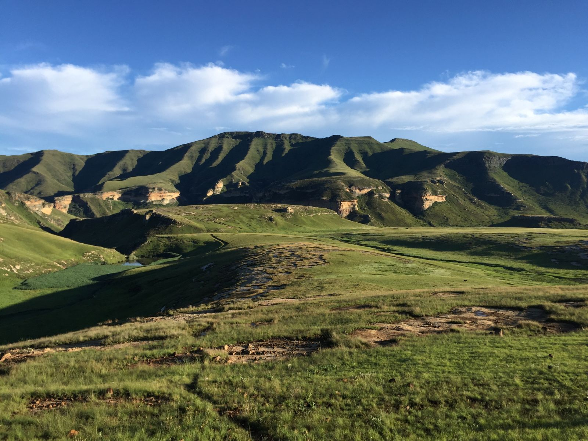
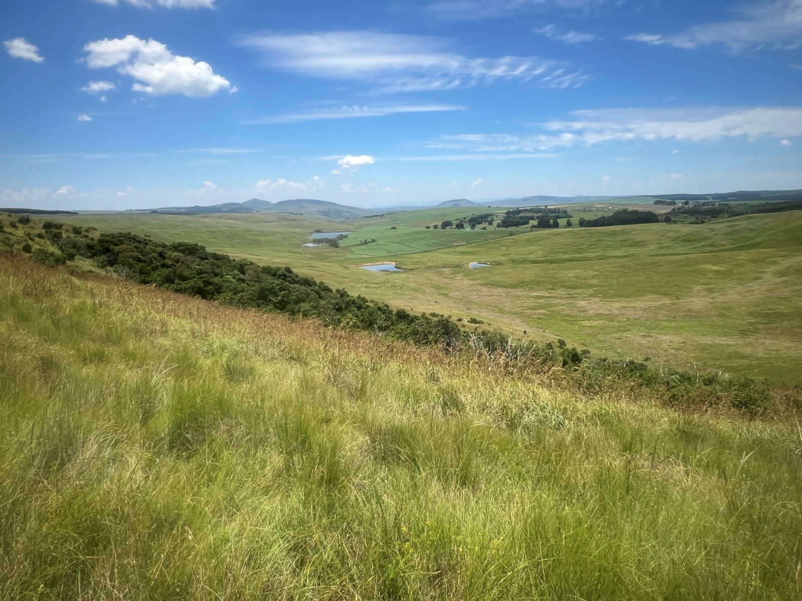
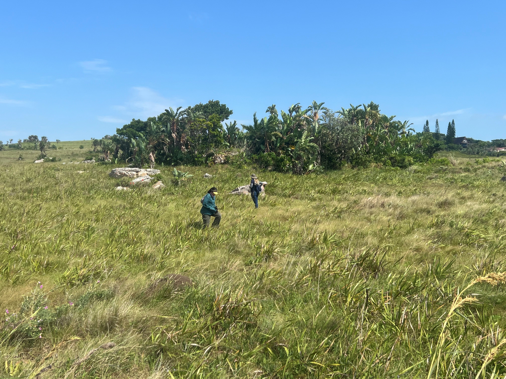
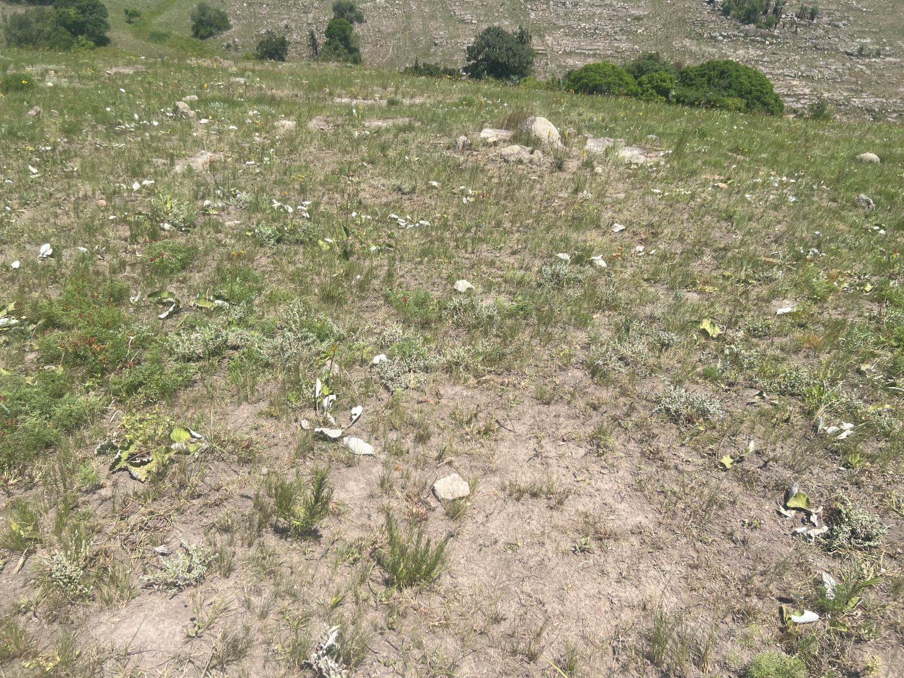
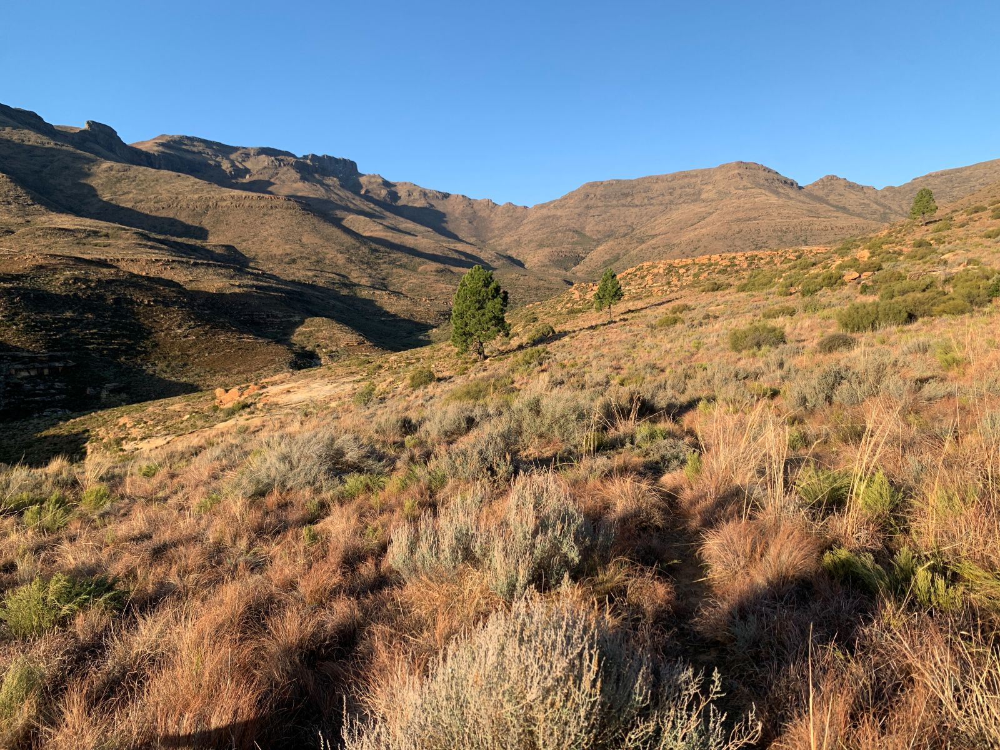
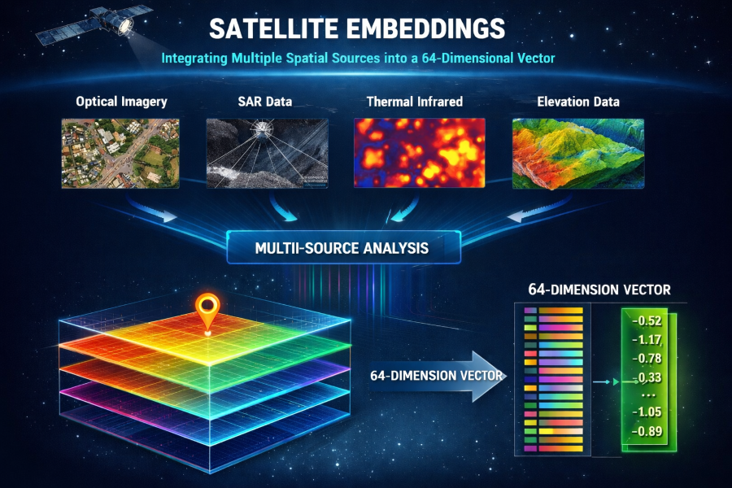

::: callout-note
The ecosystem condition assessments for this biome are still in progress. We thus provide the summary of the vegetation units, what data is currently available that may inform condition assessments or potential approaches.
:::

## Ecological Context

## Vegetation units

The Grassland biome is the second largest of the nine biomes in South Africa, occupying *c.* 29% of the land surface[@skowno2021]. Grasslands underpin human well-being by providing a range of ecosystem goods and services such as food, water, shelter, carbon storage, forage production, erosion control, and recreation. South Africa’s grasslands are fire-prone, grazing-adapted ecosystems where ecosystem condition is tightly linked to the coupling (or uncoupling) of fire, herbivory, and rainfall variability. Using the broader grassland ecosystem groupings (bioregions), we structure analyses and interpretation around: Dry Highveld, Mesic Highveld, High-Altitude (Drakensberg), Sub-Escarpment, and Coastal Grasslands. We provide summaries below adapted from the [Grassland Ecosystem Guidelines](https://bgis.sanbi.org/Projects/Detail/193).

### Dry Highveld Grassland

This ecosystem group occurs mainly across South Africa’s central plateau, spanning much of the Free State and extending into North West, with smaller patches in Gauteng and parts of the Northern and Eastern Cape. The vegetation is largely semi-arid, drought-adapted sweetveld, with many grasses persisting year to year but strong post-drought recruitment from a dormant seed bank. It typically occurs on flat to gently undulating terrain at mid-altitudes (1 300–1 600 m), under summer rainfall conditions (400–550 mm per year) and cold winters with frequent frost.

[Potential degradation indicators:]{.underline} loss of basal cover with a shift from palatable perennial grasses to patchy, short “grazing lawn” areas and bare soil, often with more karroid shrubs.

### Mesic Highveld Grassland

Moist Highveld Grassland occurs in the wetter eastern Highveld, spanning much of Gauteng, the eastern Free State and large parts of Mpumalanga, with smaller extensions into the Eastern Cape and Lesotho. It is generally represented by highly productive sourveld grasslands dominated by long-lived, resprouting grasses and other plants with substantial underground storage organs, enabling them to persist through repeated above-ground disturbance with only occasional recruitment from seed. These grasslands occur at mid-altitudes (1 300–1 800 m) across varied terrain, from broad plains to rocky outcrops, steep slopes and deep river valleys. They are adapted to warm, wet summers (700–1200 mm annual rainfall) and cool to cold winters with frequent frost. Soils are typically deep, fertile and well-drained, but may include hard, impermeable layers.

[Potential degradation indicators:]{.underline} woody thickening and/or replacement of the tall, fuel-building grass layer by unpalatable grasses, reflecting altered fire–grazing balance.

### High-Altitude Grassland

These grasslands occur across rugged mountain terrain (plateaus, peaks, steep slopes, gorges and deep valleys) under cool to very cold conditions with frequent frost, snow and mist, and mainly summer rainfall that can be very high in some escarpment areas. High-Altitude Grasslands are mostly sourveld systems characterised by slow-growing, resprouting grasses that reproduce infrequently from seed and are generally sensitive to disturbance. Two broad sub-units are typically recognised: Escarpment grasslands (\~1,400–1,800 m) stretching along the Eastern Cape–KwaZulu-Natal–Lesotho escarpment and into Mpumalanga, and Alpine grasslands (\>1 800 m) concentrated in the highest parts of the Eastern Cape, KwaZulu-Natal and Lesotho. Soils are often alkaline and basalt-derived but strongly leached by high rainfall, with a complex geological mosaic that supports specialised plant communities. It form one of South Africa’s recognised centres of endemism, with many plant and animal species found nowhere else, and a particularly rich forb flora.

[Potential degradation indicators:]{.underline} tussock breakdown into heavily grazed patches with increasing bare ground and erosion along paths and slopes.

### Sub-Escarpment Grassland

This ecosystem group comprises mesic, mid-altitude grasslands (760–1800 m) found along the base of the KwaZulu-Natal and Eastern Cape escarpment. It includes many vegetation types and is generally dominated by long-lived sourveld grasses and forbs that are strongly adapted to frequent above-ground disturbance—especially fire—by resprouting from underground storage organs. Recruitment from seed is relatively infrequent and seeds tend to be short-lived, so populations persist for long periods with most replacement occurring vegetatively via new tillers. These grasslands occur across a varied landscape of plains and rolling hills rising toward the escarpment, dissected by deep river valleys. The topographic heterogeneity helps shape local fire regimes. The climate is typically warm and wet in summer (\>600 mm annual rainfall), with dry winters that are cool to cold and frosty, and frequent mist and orographic rainfall along rising slopes. Soils are commonly nutrient-leached and support sourveld, forming a mosaic from shallow, sometimes poorly drained sedimentary-derived soils to deeper, well-drained soils associated with basalt and dolerite.

[Potential degradation indicators:]{.underline} an increasingly tussocky, uneven sward with local bare patches, often linked to overgrazing and inappropriate fire regimes.

### Coastal Grassland

A heterogeneous belt of grasslands in a narrow strip from Maputaland southwards along the KwaZulu-Natal and Eastern Cape coasts to around East London, embedded within the Indian Ocean Coastal Belt, ranging from subtropical grasslands on old sandy dunes or coastal flats (often linked to a shallow water table) to southern coastal grasslands on rocky plateaus and complex terrain (dunes, incised valleys, cliffs, ravines). These grasslands occur at low altitudes (20–600 m) under warm, humid, high rainfall summers (1 000 mm annually) and mild, frost-free winters. They are mesic, fire-adapted systems with strong resprouting capacity, and despite comprising relatively few vegetation types, they include two national centres of endemism—most notably the Pondoland–Ugu centre, which is exceptionally rich in endemic species. High geological and soil diversity, particularly on sandstone outcrops, underpins the region’s high plant diversity and endemism.

[Potential degradation indicators:]{.underline} overgrazing that creates persistent bare patches and erosion on dunes or coastal slopes, often alongside invasive plants.

## Key pressures

Most pressures in South Africa converge in the Grasslands. The dominant historical drivers of biodiversity loss are annual and perrenial crop production, plantation forestry, urban expansion and infrastructure, mining, and dams [@skowno2021], which fragment remaining primary grassland and remove or alter soils and hydrology. Changes due to these pressure are already monitored in the [National Biodiversity Assessment](https://sanbi-nba.github.io/nba-website/content/terrestrial/ter_overview.html) by using the [South African National Land Cover](https://www.dffe.gov.za/egis) data sets, cross referenced to the ecosystem types of the [National Vegetation Map](https://bgis.sanbi.org/vegmap) to calculate the extent of each land cover class. The remaining areas are mostly used for livestock production and ranching, i.e. are working rangelands, where degradation is subtle, such as shifts in species composition, change in vegetation structure, basal cover, erosion risk, and woody thickening, often without a clear land-cover change signal.

-   Woody encroachment: reduced grazeable grass layer and altered vegetation structure (an example of greening meaning “bad” in this context)

    ![Fire exclusion may lead to woody encroachment such as this native Leucosidea sericea (Outhout) that has expanded in the Mesic Highveld and High Altitude Grassland\[\@gwate2024\] in sites where fire regimes have not been managed appropriately. (©Stephni van der Merwe)](imgs/fireexclusion.jpg){width="497"}

-   Overuse of rangelands: declining basal cover, compositional shifts, patchiness, and increased erosion susceptibility (often climate-confounded)

{width="511"}

-   Invasive alien plants: competitive displacement and hydrological impacts

{width="503"}

-   Fire regime disruption: structural change, increased erosion risk, invasive establishment, and facilitation of woody thickening

## Potential remote sensing approaches

Grassland condition is mapped in many ways, but generally the focus is on productivity for livestock production[@rapiya2026]. Most remote-sensing monitoring of grassland integrity thus starts with productivity[@seymour2025], estimated through vegetation greenness, e.g. NDVI or fractional vegetation cover (FVC) or canopy metrics, like a leaf area index as a proxy for "veld condition". The key goal is to assess the ability of the vegetation to provide fodder for livestock or game, i.e. grass biomass, with less attention placed on forbs and unpalatable species.

Long-term trends and anomalies in NDVI/EVI or net primary productivity can be used to flag areas with persistent declines (or atypical increases) relative to their surroundings[@gonzalez2023]. To reduce climate confounding, a common approach is to adjust productivity signals for rainfall and seasonality (e.g., residual-trend approaches such as RESTREND or related climate-normalisation methods) so that remaining trends are more indicative of human-driven degradation or recovery[@xing2025]. Beyond productivity, many workflows add complementary indicators of structure and ground cover (bare soil, woody cover signals, fire-regime metrics, and spatial heterogeneity) to better separate degradation mechanisms that can look similar in greenness alone. Since the utility of remote sensing to detect species composition is still in its infancy, few approaches are able to differentiate whether the herbaceous vegetation is intact or not. For instance, unpalatable grasses or invasive grasses or forbs may not be detected in FVC, and erroneously be classified as primary or productive grasslands.

### 1) Habitat loss and fragmentation (context layer, not the project's pressure focus)

-   **What to map:** Natural *vs* transformed extent; recent conversion hotspots; fragmentation (edge density, patch size, connectivity) within each bioregion.
-   **Approach:** National or global land cover products for baseline masking and change detection between time steps; compute landscape metrics in moving windows (e.g. 1–5 km) stratified by bioregion.
-   **Already available:** [SANLC](https://www.dffe.gov.za/egis) (and many [globa](https://landcarbonlab.org/insights/global-land-cover-maps-accuracy-applications/)l national land cover products).

### 2) Grazing pressure and overutilisation of rangelands (subtle degradation gradients)

-   **What to map:** Persistent reductions in cover or productivity relative to climate; persistent increase in bare soil cover; increased patchiness; slow shifts in seasonal dynamics.
-   **Approach (time series):**
    -   Landsat/Sentinel-2 vegetation index time series (NDVI/EVI) summarised as long-term median, 5th percentile, interannual CV, and trend.
    -   Fractional Vegetation Cover provides sub-pixel estimates of tree, shrub, herbaceous and bare soil, making it a core layer for grassland condition because it captures ground cover directly (often more interpretable than NDVI alone).
    -   Climate-adjusted productivity diagnostics (e.g. residual trend methods) using rainfall covariates to separate drought effects from degradation signals.
    -   Spatial heterogeneity metrics (texture of NDVI/EVI; local variance) to detect patchiness typical of overuse.
-   Evaluate signals within rainfall zones and landforms; compare against reference sites (protected areas / least-impacted rangelands) to reduce confounding by natural gradients.

### 3) Fire regime disruption (too frequent, too infrequent, wrong season)

-   **What to map:** Fire return interval; seasonality; fire deficit/excess relative to expected regime per bioregion.
-   **Approach:**
    -   Burned-area products ([MODIS/VIIRS](https://firms.modaps.eosdis.nasa.gov/map/#d:24hrs;@0.0,0.0,3.0z)) to derive fire frequency, time-since-fire, and season-of-burn metrics (see e.g. [@huang2025]).
    -   Combine with fuel proxies (multi-year biomass/NDVI) and rainfall to interpret whether changes reflect altered management *vs* climate variability.
-   The goal is a fire regime layer per bioregion that flags areas likely outside typical bounds (e.g. long unburnt mesic grasslands, or overly frequent burns in erosion-prone settings).
-   **Already available:** numerous fire management products are available, such as [FIRMS](https://firms.modaps.eosdis.nasa.gov/map/#d:24hrs;@0.0,0.0,3.0z).

### 4) Woody encroachment / thickening

-   **What to map:** Increasing woody cover within historically open grassland; shifts toward more evergreen/woody phenology; structural change.
-   **Approach (multi-sensor):**
    -   Long-term greening signals (EVI/NDVI trends) interpreted cautiously (greening can be recovery or encroachment).
    -   Seasonal/phenology separation (harmonic metrics or seasonal composites) to distinguish woody vs grassy timing and persistence.
    -   Radar backscatter metrics (Sentinel-1) or canopy-structure proxies where feasible to corroborate woody structural increase.
-   **Already available:** National-scale vegetation trend products based on [Landsat EVI](https://zandersamuel.users.earthengine.app/view/evi-trend-inspector)[@venter2020] can be used as an initial screen for areas of persistent greening potentially consistent with woody thickening.

### 5) Invasive alien plants (especially woody invasives and riparian invaders)

-   **What to map:** Invasive species presence, density or extent in priority landscapes; spread fronts; post-clearing recovery trajectories.
-   **Approach:**
    -   Supervised classification with Sentinel-2 or Landsat using spectral + phenology features; include terrain and distance-to-drainage predictors for riparian invasions.
    -   Object-based mapping (segmentation) in heterogeneous coastal or sub-escarpment landscapes where pixel mixing is strong.
    -   Change detection for management monitoring (pre-/post-clearing NDVI/cover recovery).
-   **Already available:** the National Invasive Alien Plant Survey has mapped the cover of key invasive in South Africa[@kotzé2025]; [woody invasive species](https://sites.google.com/view/alanna-rebelo/mapwaps) have been mapped in four of South Africa's key catchments, three of which occur in Grasslands.
-   **Practical note:** Treat IAP mapping as a targeted layer (priority catchments/coastal belts) rather than attempting uniform national detection.

### Implementation principles (applies across pressures)

-   Stratify by grassland bioregion (and rainfall zone/landform where possible) and by environmental gradients within each bioregion to avoid conflating natural variation with degradation.
-   Use a reference-based lens where feasible (protected areas / least-impacted sites) to interpret deviation in cover, phenology, and structure.
-   Prefer multi-metric evidence (e.g. trend + heterogeneity + fire regime) over single indices, especially in climate-variable grasslands.

::: callout-note
## Potential new ways of using satellite embeddings to map condition

Satellite embeddings compress thousands of satellite data layers into annualised 64 dimensions to capture complex spectral–spatial patterns beyond simple indices. Google's Alpha Earth's satellite embeddings are available from 2017 to 2024[@brown]. It includes optical and thermal data (Landsat 8 and Sentinel-2), radar data (SAR), 3D surface measurements and data from many more sources, compressed to a analysis-ready dataset. The tradeoffs of this product are that it is annual data (summarised per year) and embeddings have no inherent meaning, so we cannot interpret them as "layers" or drivers of ecosystem condition. For example, layer 1 in the 64 dimensions doesn't correspond to a specific satellite band.

1.  Similarity search: some pressures may be mapped using the similarity of pixels that occur near each other in the embeddings space. For example to a map woody invasive species. We can calculate the cosine angle (i.e. distance) in the 64 dimensional embedding space. Pixels with short distances, are more similar and further more different.
2.  Supervised classification: if field-validated training points are available that label grassland sites across a gradient of condition (e.g., intact → moderately degraded → severely degraded → transformed), a potential new approach we are testing is to model ecosystem condition directly using satellite embeddings which can be used as predictors in supervised classification (e.g., Random Forest or gradient boosting), and combined with climate/terrain covariates to reduce confounding by natural gradients. The fitted model can then predict condition over the study site.
3.  Unsupervised clustering: if training data for condition "states" or pressures are not available (e.g. if experts are not comfortable assigning condition to sites), embeddings could also be used for unsupervised clustering of pixels with simialar embeddings values.

{width="609"}
:::

## References

::: {#refs}
:::
