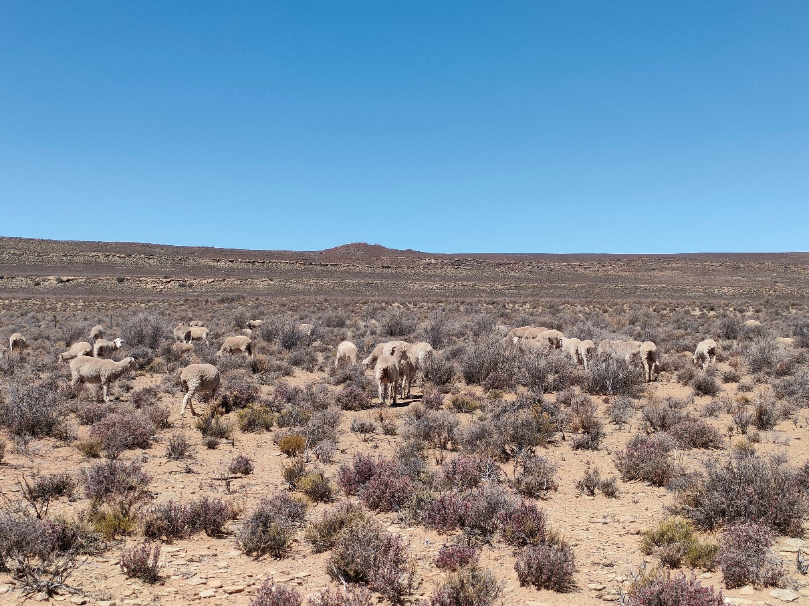
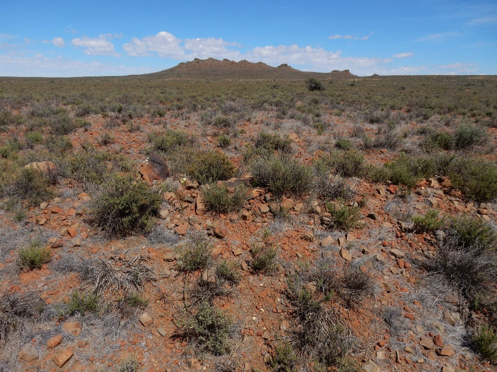
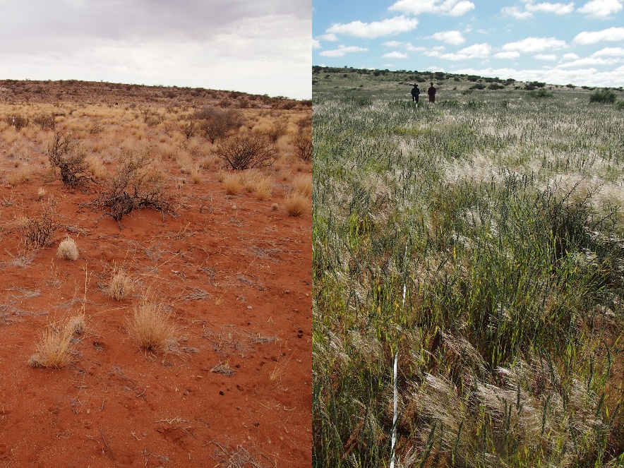
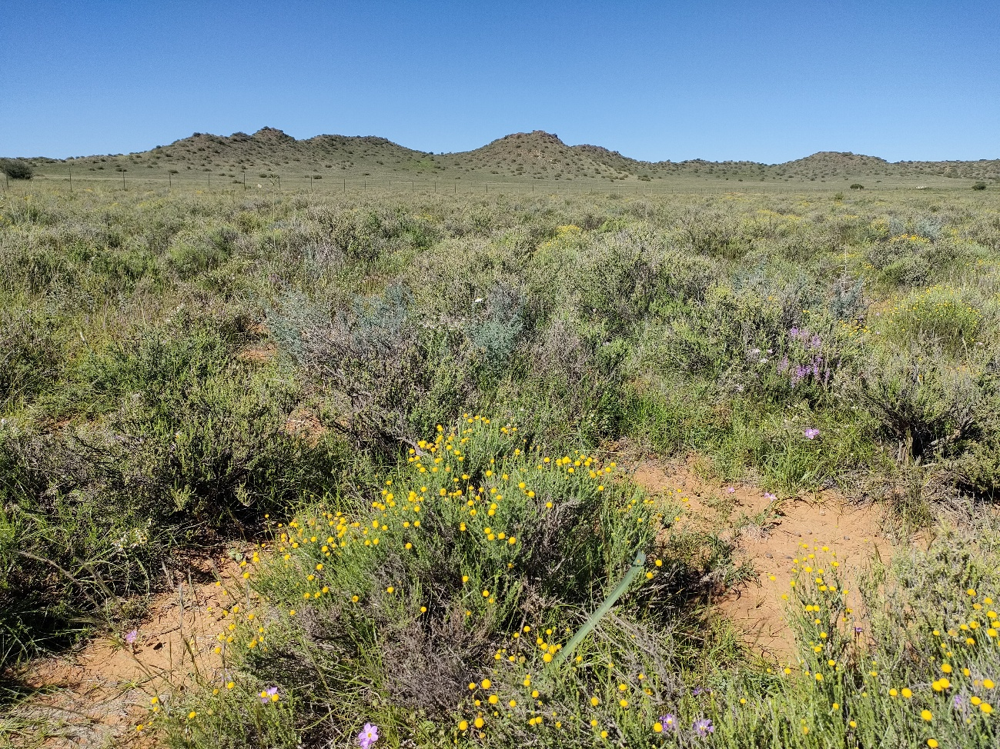
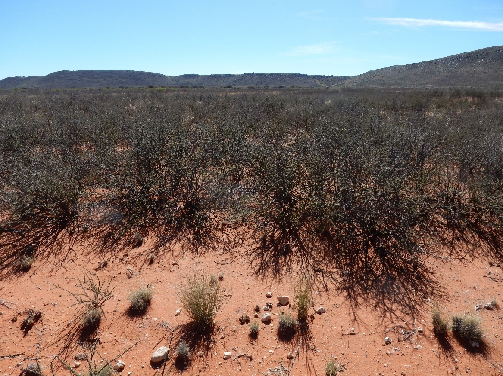
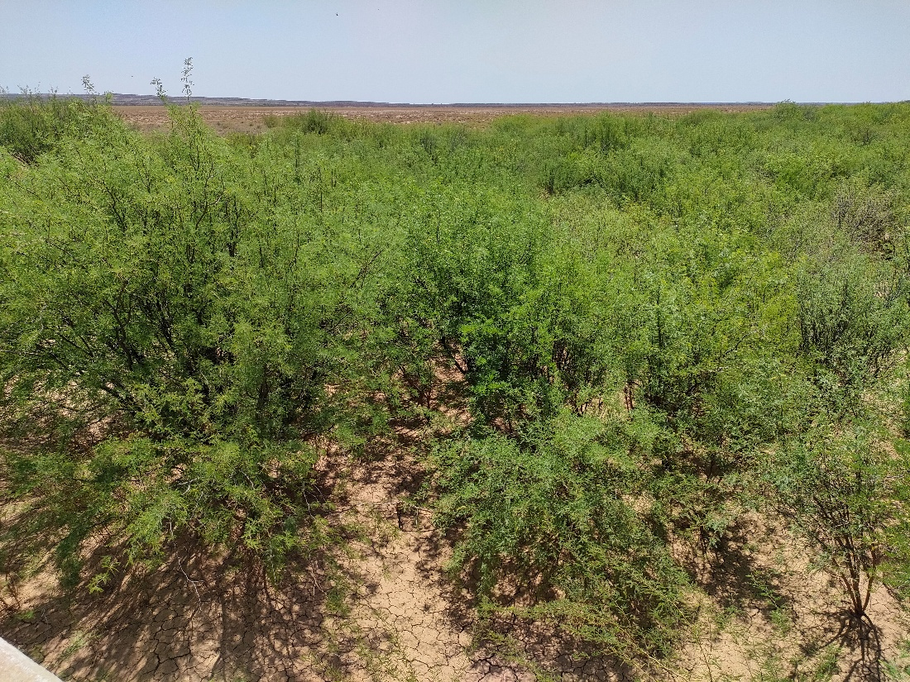

# Ecological context

## Vegetation units

The Nama-Karoo biome is located in the western inland of South Africa, covering approximately 20% of the country’s land area. Being a water-limited, semi-arid to arid environment (70–500 mm annual rainfall), ecological dynamics in the biome are strongly regulated by erratic rainfall, most of which falls during the late summer months. A sparse mix of dwarf shrub and grass species adapted to harsh conditions is typical of the vegetation in the biome, while considerable variation in vegetation cover, structure, and composition occurs across the biome [@mucina2006; @esler2006]. Most of the land is used as rangeland, particularly for sheep farming by commercial farmers for more than a century [@hoffman2018]. Three broad bioregions are recognised in the biome, largely corresponding to topographic and geological features.

> Sheep grazing in rangelands near Fraserburg, Northern Cape. Sparse, grassy shrubland characterises Nama-Karoo vegetation.

### Lower Karoo

The Lower Karoo occurs in the lowlands (\~300–1,000 m) south of the Great Escarpment. Intact rangelands in the Lower Karoo are characterised by a diverse mixture of dwarf shrubs and perennial grasses, including palatable species [@esler2006]. These systems respond to seasonal and interannual rainfall fluctuations, representing dynamic yet generally resilient systems with varying vegetation cover and structure. Woodland occurs locally along seasonal river lines.

Degraded rangelands are characterised by increased bare patches, reduced vegetation cover, and dominance of unpalatable species, often resulting from selective grazing and trampling by livestock [@esler2006]. These impacts may appear as contrasts across fence lines or near water points. However, it is often difficult to distinguish grazing-induced degradation from natural variation. In the drier parts of the bioregion, rainfall fluctuations have a stronger influence on vegetation dynamics, and the impacts of excessive grazing may be weak or difficult to detect in a single temporal snapshot [@saayman2022].

### Upper Karoo

The Upper Karoo occurs on the uplands (\~1,000–1,900 m) north of the Great Escarpment. The landscape is characterised by koppies scattered across extensive flat plains. Similar to the Lower Karoo, intact rangelands are characterised by a diverse mixture of shrub and perennial grass species that naturally fluctuate with rainfall variability [@esler2006].

Degraded rangelands are characterised by increased bare patches, reduced vegetation cover, and dominance of unpalatable species. In susceptible areas, reductions in vegetation cover may also increase soil erosion risk. In some regions, dominance by woody shrub species such as *Rhigozum trichotomum* is perceived as a legacy effect of historical grazing, although the underlying mechanisms remain poorly understood.

> Upper Karoo landscape with extensive flat plains and koppies between Fraserburg and Leeu Gamka along the R353, Northern Cape.

### Bushmanland

Bushmanland occurs in the northernmost part of the biome. It represents the harshest environment among the three bioregions, with lower and less predictable rainfall and higher mean temperatures. Relatively little field-based information is available for this bioregion. Like the other bioregions in the biome, intact vegetation is typically grassy dwarf shrubland dominated by drought-adapted species, including *Stipagrostis* species. However, vegetation structure is also strongly influenced by biophysical factors such as landforms, soil depth, and soil properties [@mucina2006].

Although evidence is limited, degraded rangelands in Bushmanland likely share similar diagnostic characteristics with those in other bioregions [@esler2006]. In addition to grazing-induced changes, riverine habitats are often affected by invasive woody plants such as *Prosopis* spp., which transform vegetation structure by forming dense stands along drainage lines [@vandenberg2013]. Similarly, increased woody cover by *Rhigozum trichotomum* and *Senegalia mellifera* is associated with degraded rangelands [@hoffman1999].

> Dramatic increases in vegetation cover between the dry season (November 2024) and rainy season (April 2025) demonstrate strong seasonal variation in Bushmanland vegetation near Kenhardt, Northern Cape.

# Key pressures

The Nama-Karoo biome has experienced relatively limited large-scale land-use change, with approximately 98% of the biome remaining classified as natural extent [@skowno2021]. This is substantially higher than the national average (78%), indicating that declining ecological condition in the biome is generally not associated with conversion to cropland, urban development, or mining. Instead, degradation is more often associated with subtle changes in vegetation composition and structure within natural rangelands.

## Overuse of rangelands

The long history of grazing in the biome has shaped agricultural policy and degradation research in South Africa [@hoffman2018; @hoffman1999]. Karoo vegetation is generally considered adapted to grazing pressure because it evolved alongside indigenous herbivores. However, debates continue regarding how to evaluate the ecological effects of continuous sheep grazing relative to historical baseline conditions prior to European settlement.

Overuse of rangelands may lead to declining vegetation cover, shifts from palatable to less palatable species, replacement of perennial species by short-lived species, and increases in bare ground. These changes may further increase susceptibility to soil erosion. Interpreting degradation patterns is complicated by strong rainfall variability, because increases in vegetation cover may reflect favourable rainfall conditions rather than ecological recovery [@esler2006; @dutoit2018].

> Well-managed rangelands near Colesberg, Northern Cape, typically support diverse mixtures of dwarf shrubs and perennial grasses following good rainfall.

## Woody encroachment

Woody encroachment has been reported across parts of the biome, although recent updates on its extent remain limited. Increased canopy cover of tall woody shrub species such as *Senegalia mellifera* and *Rhigozum trichotomum* is commonly observed. Encroachment is widely perceived to be associated with historical grazing pressure, although the underlying ecological mechanisms are not fully understood. Woody encroachment may reduce grazing capacity and alter vegetation structure, with cascading effects on biodiversity, soil properties, and carbon storage.

> Rangelands dominated by *Rhigozum trichotomum* (driedoring), characterised by low species richness and reduced grazing capacity, between Britstown and Prieska, Northern Cape.

## Invasive alien species

Alien plant species richness in the Nama-Karoo biome is relatively low, although *Prosopis* spp. are notable because of their invasiveness, extent, and ecological impacts. Among several species and hybrids, *P. velutina* and *P. glandulosa var. torreyana* are of particular concern.

The impacts of *Prosopis* spp. on ecosystem services and biodiversity are well documented. Dense stands with deep root systems may contribute to groundwater depletion through high water use. From a rangeland management perspective, *Prosopis* reduces forage availability by outcompeting indigenous species and limiting accessibility through dense thicket formation. Negative effects on biodiversity, including impacts on plants, insects, and birds, have also been documented, as these species can transform open shrublands into thicket-like vegetation [@shackleton2015]. Despite these impacts, *Prosopis* species also provide benefits to people, including fodder, fuelwood, and shade.

> Dense stands of *Prosopis* spp. along riverine habitats near Sakrivier, Northern Cape.

## Climate change

Climate change is expected to interact with existing pressures in the Nama-Karoo biome by altering rainfall variability, increasing drought frequency, and intensifying temperature extremes. These changes may further complicate efforts to distinguish natural variability from long-term ecological degradation.

# Potential remote sensing approaches

## Woody encroachment

Satellite remote sensing offers considerable potential for monitoring woody encroachment in the Nama-Karoo biome.

#### Candidate metrics

Approaches for mapping woody cover from satellite imagery are relatively well established. Rangeland degradation associated with increasing cover of tall woody shrubs can potentially be quantified using time-series analyses of woody vegetation cover.

#### Existing products and datasets

Several global and regional woody cover products are available. However, most models were not specifically developed for arid shrublands, and their accuracy and spatial resolution vary substantially. Evaluating the suitability and accuracy of these products for Nama-Karoo vegetation remains important.

## Overuse of rangelands

### Pressure or condition signal

Overuse of rangelands can potentially be monitored through two complementary approaches: mapping degradation symptoms and estimating grazing pressure. Symptoms such as increased bare ground, reduced vegetation cover, and changes in vegetation functional types may potentially be inferred using satellite remote sensing. In contrast, direct estimation of grazing pressure from remote sensing remains challenging.

### Mapping degradation symptoms

#### Candidate metrics

Arid and semi-arid rangelands have historically been challenging environments for remote sensing because indices such as NDVI perform poorly in sparsely vegetated drylands. However, recent advances in remote sensing approaches have improved the operational monitoring of degradation indicators.

Methods for identifying bare ground and estimating vegetation cover are now relatively established, and large-scale mapping of vegetation life-form classes is increasingly feasible, although it generally requires large training datasets. In contrast, mapping species composition directly from satellite imagery remains challenging.

The effectiveness of remote sensing-based assessments depends on the ecological relevance of the selected degradation indicators (e.g., vegetation cover, bare ground, or life-form composition), the accuracy of the predictions, and the correspondence between the indicators and degradation processes. Another major challenge is accounting for climatic variability in these arid systems. Rainfall variability is typically analysed using long-term time-series data to separate degradation signals from short-term climatic fluctuations. Ground validation and contextual interpretation remain essential for reliable assessments.

#### Existing products and datasets

Several products for estimating bare surface cover are available, although many provide binary outputs and may therefore have limited utility for detecting subtle changes. Detailed functional-type mapping products are not yet available for South Africa. Fractional cover products derived from spectral unmixing approaches, such as the Digital Earth Africa Fractional Cover product, may offer useful alternatives, although their applicability in the Nama-Karoo biome remains largely untested.

### Mapping grazing pressure

#### Candidate metrics

Livestock numbers may serve as a proxy for grazing pressure.

#### Existing products and datasets

Global satellite-derived livestock density datasets are available, such as the Gridded Livestock of the World (GLW4) dataset. However, their accuracy in South Africa has not been comprehensively evaluated. Alternative data sources, including agricultural census statistics or locally calibrated livestock datasets, may provide more reliable estimates [@hoffman2018].

## Invasive alien species

### Pressure or condition signal

Satellite remote sensing offers potential for identifying areas infested by problematic invasive alien species in the Nama-Karoo biome.

### Candidate metrics

The cover and extent of *Prosopis* spp. can represent degraded rangeland and riverine habitat associated with invasive alien plants. *Prosopis* stands may produce distinct spectral signatures relative to surrounding open shrublands, although distinguishing them from indigenous woody species such as *Vachellia karroo* can be difficult using multispectral imagery alone.

### Existing products and datasets

Several efforts have focused on mapping *Prosopis* spp. using remote sensing in the Nama-Karoo biome [@vandenberg2013]. More recently, national-scale mapping products for major invasive alien plants, including *Prosopis* spp., have become available [@kotze2025].

# References

::: {#refs}
:::
