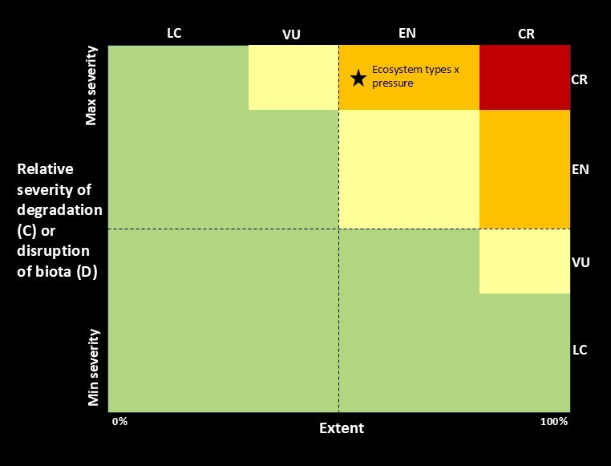

## What we mean by “ecological condition” and "ecosystem condition"

While there are various interpretations, "ecological condition" is a general ecological term for the state or quality of an ecosystem, habitat or site, based on how its species, communities, and ecological processes, compare to expected natural patterns for that unit. "Ecosystem condition" usually refers to the same concept, but has an inherent spatial unit of "ecosystem type". Following Keith et al. (2020)[@keith2020], who expanded on the SEEA EA definition of ecosystem condition, we define ecosystem condition as the “quality of an ecosystem that may reflect multiple values, measured in terms of its abiotic and biotic characteristics across a range of temporal and spatial scales. Quality is assessed with respect to ecosystem structure, function and composition, which underpin the ecological integrity of the ecosystem”. In practice, remote sensing is currently strongest for detecting *structure and function* (e.g., cover, biomass proxies, phenology, productivity), while composition usually needs field data and expert interpretation.

## Why map ecosystem condition?

To accurately assess the state of biodiversity, we need to monitor the expansion and contractions of natural habitat. Therefore, the spatial extent is the contextual unit for understanding ecological condition. Once we have the remaining extent, the unit of which is ecosystem type for our purposes, we can assess and monitor the integrity of the natural remnants. South Africa has a longstanding ecosystem map and land-cover products for tracking **habitat loss**, but many pressures occur *within remaining natural area.* For example, unsustainable grazing, woody encroachment, invasive species or altered fire regimes which can reduce ecosystem integrity even when land cover still looks “natural” on a map.

We thus developed a general repeatable, context-specific approach to map ecosystem condition so that it can be used for conservation planning, restoration prioritisation, ecological research and national reporting (see Workflow).

## Key guidelines for this work

While this research extends beyond developing data for ecosystem risk assessments and ecosystem accounting, there are useful guidelines available to navigate the broad subject matter of ecosystem condition. Two complementary global standards provide internationally recognised frameworks for recording and interpreting changes to ecosystems:

-   The [IUCN Red List of Ecosystems](https://iucnrle.org/)[@keith2024] (RLE) and

-   [UN System of Environmental-Economic Accounting Ecosystem Accounting](https://seea.un.org/)[@edens2022] (SEEA EA),

Both rely on the [IUCN Global Ecosystem Typology](https://global-ecosystems.org/)[@iucnglo2020] (GET) as their foundational ecosystem classification and maps. The RLE assesses biodiversity loss of ecosystems by quantifying the risk of ecosystem collapse, whereas the SEEA EA associates ecosystem change with the services provided to the economy or people. Both serve as headline indicators for the GBF for national and global reporting, with South Africa being a pioneer in implementing both standards. In SEEA EA, condition accounts record selected biophysical characteristics of ecosystems through time, typically relative to a reference condition, which provides the bridge between extent and services accounts. In the RLE, ecosystem condition is operationalised via Criteria C (environmental degradation) and D (disruption of biotic processes), which assess the severity and extent of degradation relative to “collapse thresholds” (Fig. 1).

{width="503"}

## The SBAPP project

This research was initiated as part of a regional project that ends in 2027 called the [Spatial Biodiversity Assessment, Prioritization, and Planning (SBAPP)](https://www.sanbi.org/biodiversity/building-knowledge/biodiversity-monitoring-assessment/the-sbapp-regional-project/) in South Africa, Namibia, Malawi and Mozambique. Objective 4 of this project aims to map ecosystem condition and this website provides the workflows and first case studies produced during this project.

These databases will be used to inform how we monitor and report on:

-   [The IUCN Red List of Ecosystems](https://iucnrle.org/);

-   [Targets for the Kunming – Montreal Global Biodiversity Framework](https://www.post-2020indicators.org/).

-   Land Degradation Neutrality targets of the UNCCD.

-   Restoration prioritisation.

-   Strategic conservation planning

### Definitions

Ecosystem condition, ecosystem health and ecosystem integrity are often used interchangeably.

**Ecosystem condition (UN SEEA EA)**: "The quality of an ecosystem asset, measured through its biotic and abiotic characteristics, typically assessed relative to a defined reference condition and tracked over time"

**Ecosystem integrity (IBPES):** "The ability of an ecosystem to support and maintain ecological processes and a diverse community of organisms. It is measured as the degree to which a diverse community of native organisms is maintained, and is used as a proxy for ecological resilience, intended as the capacity of an ecosystem to adapt in the face of stressors, while maintaining the functions of interest."

**Ecosystem Functional Group (from the Global Ecosystem Typology)**: A group of related ecosystems within a biome that share common ecological drivers, which in turn promote similar biotic traits that characterise the group. Derived from the top-down by subdivision of biomes.

## References

::: {#refs}
:::
