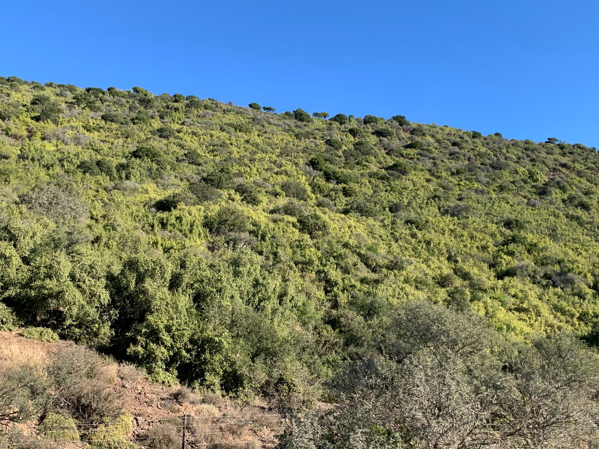
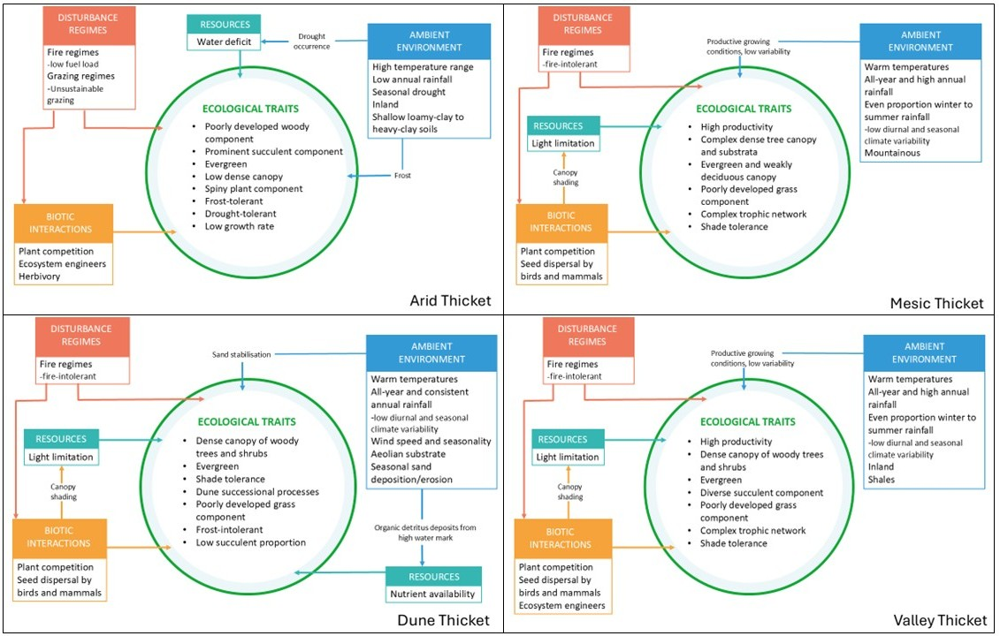
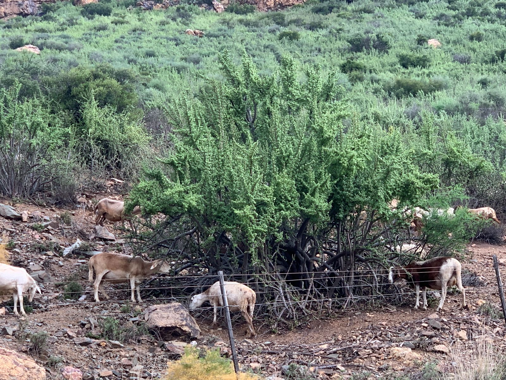
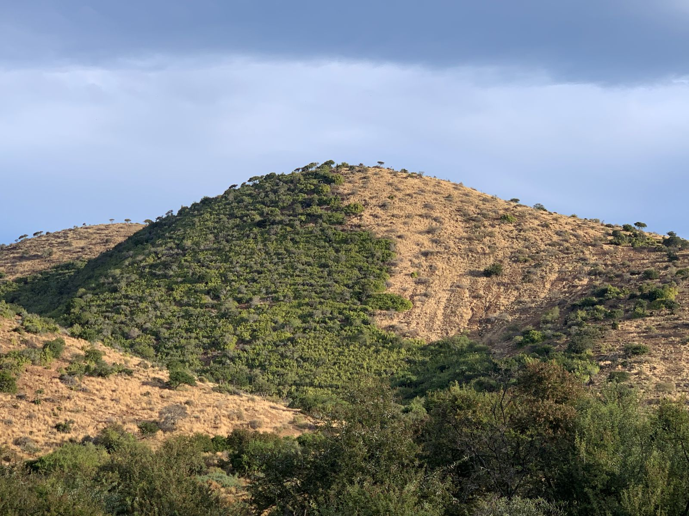

## Ecological Context

### Vegetation units

The Albany Thicket Biome is a structurally complex and compositionally diverse vegetation that occupies a transitional zone between the country's arid interior and its more mesic coastal regions. Thicket vegetation varies along key environmental gradients of moisture availability, soil type, topography, and rainfall seasonality, giving rise to a variety of growth forms occurring in a mosaic of distinct vegetation clumps[@vlok2002]. Intact solid Thicket vegetation, i.e. untransformed and not in mosaics or bush clumps, is characterised by its resilience to certain disturbances, such as fire and herbivory, due to its dense near-impenetrable canopy and thorny structure. However, once disturbed, Thicket vegetation exhibits a low regenerative capacity, often failing to return to its original stable state or requiring decades for recovery of the slow-growing species[@lechmere-oertel2005]. This has significant implications for conservation, as the remaining intact Thicket needs to be prioritised for protection, and degraded sites actively restored where possible. Indeed, restoration efforts in the Thicket has shown remarkable success when given space and time for recovery in protected sites.

{width="907"}

At the bioregion-level, along the coastal fringe, Dune Thicket occurs on aeolian sands with high wind exposure and saline influences. This vegetation is characterised by a dense woody canopy, low succulent presence, and species adapted to sand stabilisation and frequent disturbance. Inland from the coast, Valley Thicket is found along major river systems and in topographic hollows with elevated soil moisture and fertile, shale-derived soils. These systems support a rich assemblage of woody and succulent species and are notable for their resistance to seasonal climatic fluctuations. In regions with moderate, year-round rainfall, Mesic Thicket occupies fire-protected topographic refugia such as deep valleys and southern slopes. It forms a dense, stratified canopy of evergreen and weakly deciduous shrubs and trees similar to forest vegetation, and plays a critical role in soil retention and carbon sequestration. By contrast, Arid Thicket dominates the interior valleys and escarpment foothills, where rainfall is low and erratic, and vegetation is shaped by chronic water deficit, nutrient-poor soils, and intense grazing pressure. Arid Thicket is distinguished from other thicket forms by a poorly developed woody component and a prominent succulent layer, with communities being either dominated by *Portulacaria afra* (eg. in Spekboomveld) or by other succulents (eg. in Noorsveld). All the bioregions also occur in mosaics with other biomes[@hoare2006]. We summarised the "intact" ecosystem functioning of these bioregions as conceptual functional models ([Fig.1](#fig1))

{#fig1}

### Key pressures in Thicket

The degradation of Thicket has been ongoing for over a century. Historical accounts of vast areas of dense, thorny and impenetrable vegetation, are rarely seen today. Other than outright habitat loss due to urban development and croplands, the replacement of indigenous megaherbivores (like elephants) with high densities of domestic stock has caused severe degradation of the natural landscapes[@lechmere-oertel2008]. Historical overstocking of livestock has thus likely been the primary driver of vegetation change in the arid parts of this biome over the past 200 years, outweighing natural climatic fluctuations​. Inside protected areas such as Addo Elephant National Park, browsing by elephants also impacts thicket structure (e.g. converting tall thicket to a shorter, more open state), but this is a more localised effect compared to the widespread clearing for citrus planting or unsustainable herbivory in rangelands. Outside these refuges, many thicket landscapes are in various stages of degradation, with reduced shrub or succulent cover, altered species composition, and diminished ecological function (lower carbon stocks and soil stability), often being indicators of degradation.

{width="875"}

The Thicket biome faces increasing pressure from anthropogenic activities, particularly overgrazing/browsing by livestock such as goats or extralimital game species, which has led to severe degradation, such as loss of key plant species and canopy cover, increasing grass cover and soil erosion in many areas. Continued selective grazing often leads to a transition from palatable perennial species to unpalatable and short-lived species. Soil erosion, largely driven by unsustainable herbivory, contributes to the loss of topsoil and further diminishes the ecological integrity of these areas by reducing regenerative capacity, ultimately resulting in carbon loss[@mills2005]. Additionally, climate change poses a long-term threat to the Thicket biome, with shifts in temperature and precipitation patterns potentially altering the distribution and composition of vegetation, as climatic niches shift. Droughts in particular are predicted to increase in South Africa, and pose a major threat to the ecological condition of Thicket. While invasive species do not cover a large extent of the biome, localised dense cover of species such as Australian wattles and *Opuntia* species, further exacerbate degradation by outcompeting native vegetation and changing ecosystem processes through altered nutrient cycling, hydrology and fire regimes[@kraaij2022].

{width="745"}

## Case study

Because of the evergreen nature of intact Thicket vegetation, remote sensing approaches to ecosystem condition mapping is a feasible option. The legacy of degradation research in the biome provides a strong foundation for ecosystem condition assessments. Coupled with the recent demand for condition data to prioristise restoration activities, Albany Thicket provided an ideal first case study to our SBAPP project (Fig. 1).

The results can be browsed in this [Google Earth Engine App](https://ee-stephnivdm.projects.earthengine.app/view/thicket-ecological-condition), although it is still under review.

## Methods

### Training data

The SBAPP project views ecological condition as a continuum from transformed (habitat loss) to intact. Training data consisted of collated data set of condition-labelled points assigned through expert interpretation and known field-validated examples of Thicket in different states across the east-west environmental gradients. Training points were targeted in piospheres around artificial watering points with clear structural changes with browsing pressure, and along fence-line contrasts because these locations provide strong, unambiguous signals of herbivore-driven degradation. The close spatial pairing of fence-line contrasts reduces confounding environmental variability and increases the confidence that observed vegetation differences are primarily the result of land use history rather than underlying abiotic gradients. Transformed points were manually digitised in Google Earth Engine using the basemap. Points were classified into four condition classes: intact, moderate, severe, and transformed.

Ecological interpretation of the classes followed the state-and-transition framework used by Thompson et al. (2009) [@thompson2009] and Lechmere-Oertel (2023)[@lechmere-oertel2023] as follows:

1\. Intact

Ecologically intact sites represent closed-canopy, structurally complete succulent/woody Thicket. These areas maintain the full complement of dominant woody species (e.g., *Portulacaria afra*, *Euclea undulata*, *Pappea capensis*), a deep litter layer, high aboveground biomass, and well-buffered microclimates. Soil surfaces are mostly shaded, erosion is minimal, and nutrient cycling remains functional. These sites correspond to the “untransformed” or “near-reference” state, showing no evidence of sustained herbivory-driven collapse.

2\. Moderate degradation

Moderately degraded Thicket exhibits partial canopy loss and early signs of structural simplification. Palatable shrubs decline but some Thicket clumps remain intact. The soil surface begins to experience intermittent exposure, ephemeral grasses, encroacher or invasiv shrubs increase in frequency, and the litter layer becomes discontinuous. This state aligns with the intermediate transition phase in Thompson et al. (2009)'s condition gradient, where degradation is evident but reversible if grazing pressure is reduced.

3\. Severe degradation

Severely degraded Thicket shows advanced canopy collapse, dominated by pseudo-savanna elements such as annual grasses, *Pentzia incana*, *Galenia* spp., and scattered remnant shrubs persisting only above the browse line. The original Thicket structure is largely lost, soil surfaces are exposed and crusted, and erosion scars are common. Nutrient cycling and microclimatic buffering have broken down. This corresponds to the high-degradation state of Thompson et al. (2009), where functional thresholds have been crossed and passive recovery is unlikely.

4\. Transformed

Transformed sites represent areas where Thicket has been completely removed by ploughing, orchards, croplands, urban development, mining, or other land-cover conversion. Ecologically, these areas no longer retain Thicket structure, species composition, or processes. In short, this class is where Thicket has lost habitat by direct human transformation.

### Predictor variables

Predictor variables were derived from the Google AlphaEarth Foundation satellite embeddings 10 m resolution annual dataset (available 2017-2024). Embeddings provide a way to compress large volumes of remote-sensing information into a compact set of features that may capture meaningful ecological and spatial patterns[@brown]. The AlphaEarth Foundation Model integrates multi-temporal imagery from open access sensors such as Sentinel-2, Sentinel-1 and Landsat, Land Cover data, elevation and learns a shared representation of the information contained across these sources. This allows each pixel’s spectral, spatial and temporal characteristics to be summarised in a small embedding vector of 64 values, that captures the key mutual information between the different sensors and the underlying landscape. Embedding values were sampled at each training point, which formed the input into a Random Forest model.

### Random Forest modelling

A supervised Random Forest (RF) regression model was trained separately for Arid, Valley, and Mesic Thicket using AlphaEarth embeddings as predictors and a continuous condition target derived from ordinal class labels in the training data. Ordinal class scores (0-1) were obtained by first applying Partial Least Squares (PLS) regression to the 64 embedding bands with ordered condition classes (transformed \< severe \< moderate \< intact) as the response, thereby extracting supervised components that capture the condition gradient (see e.g. Bell et al., 2021[@bell2021]). The number of PLS components was chosen at the RMSEP “elbow” from cross-validation and used as predictors in an ordinal logistic (cumulative link) model. The resulting latent condition axis was summarised per class and rescaled to 0-1 to produce data-driven numeric values for transformed, severe, moderate, and intact points (Bell et al., 2021). These values obtained using the pls package in R Statistical Software, were then used as the response for RF regression in GEE, enabling prediction of a continuous 0-1 ecological condition surface across each solid Thicket EFG. The numeric scaling facilitates downstream analyses, comparison across EFGs, and integration with condition frameworks such as the IUCN Red List of Ecosystems (Criteria C & D) and SBAPP’s multi-pressure condition model, which both require a continuous measure of relative degradation intensity. The models were fitted using 300 trees with class-balanced sampling, applied to the embeddings for each the three solid EFGs. Outputs were clipped to the EFG boundaries to avoid extrapolation, and water bodies were masked using classes 14-21 in the SANLC 2022 dataset. The final condition gradient was exported at 10 m resolution for expert review.

### Model validation

Model performance for the supervised Random Forest (RF) approach was evaluated using a combination of internal cross-validation and independent expert-mapped degradation maps. First, the condition-labelled points were randomly partitioned into an 80/20 train-test split, stratified by condition class to retain balanced representation of intact, moderate, severe and transformed sites. The model was trained on the 80% subset and predictions were evaluated against the held-out 20% using overall accuracy, class-specific precision and recall, and confusion matrices to quantify how well the RF distinguished different degradation states. To provide an external, ecologically independent assessment of model realism, we further validated predictions against farm-level degradation maps supplied by Thicket experts, mapped between 2020-2022, which contain spatially explicit delineations of moderate and severely degraded and intact areas. Points were randomly placed in areas that overlap with the expert-mapped polygons, where the RF predictions values were extracted, and agreement was assessed using mean predicted condition per polygon, class-wise accuracy, and visual consistency with known degradation patterns. This two-step validation of formal train-test evaluation complemented by expert-derived farm-scale benchmarks, ensured that the RF models not only performed well statistically, but also captured degradation patterns recognised by practitioners familiar with local Thicket dynamics.

### Key resources

Ecosystem guidelines, thicket vegetation research and links to important papers can be found at the [Thicket Forum's website](https://www.thicketforum.org.za/resources/knowledge).

The findings of this case study are being prepared as a manuscript.

## References

::: {#refs}
:::
