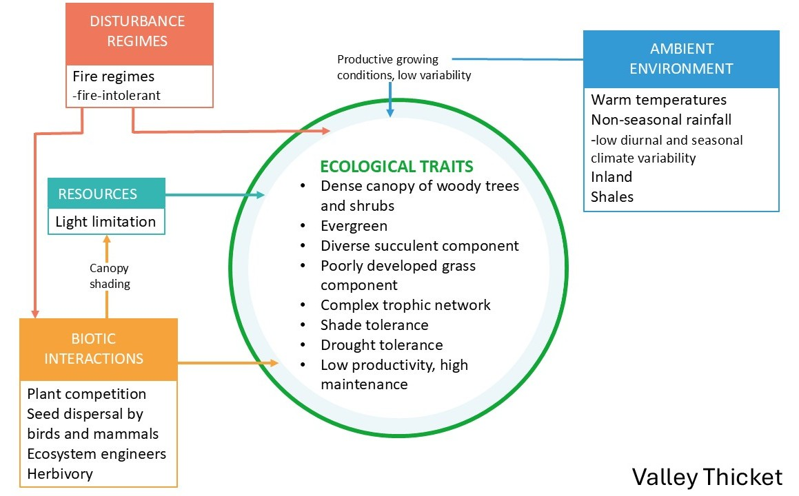
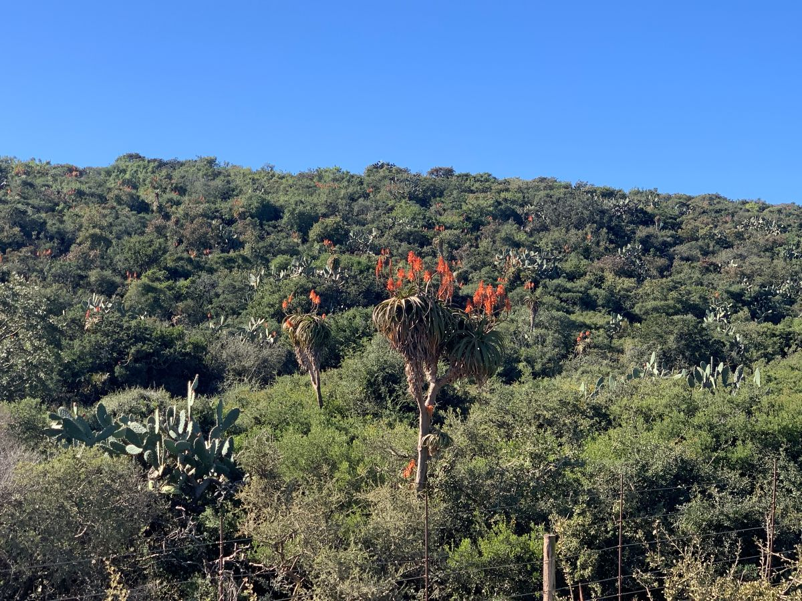
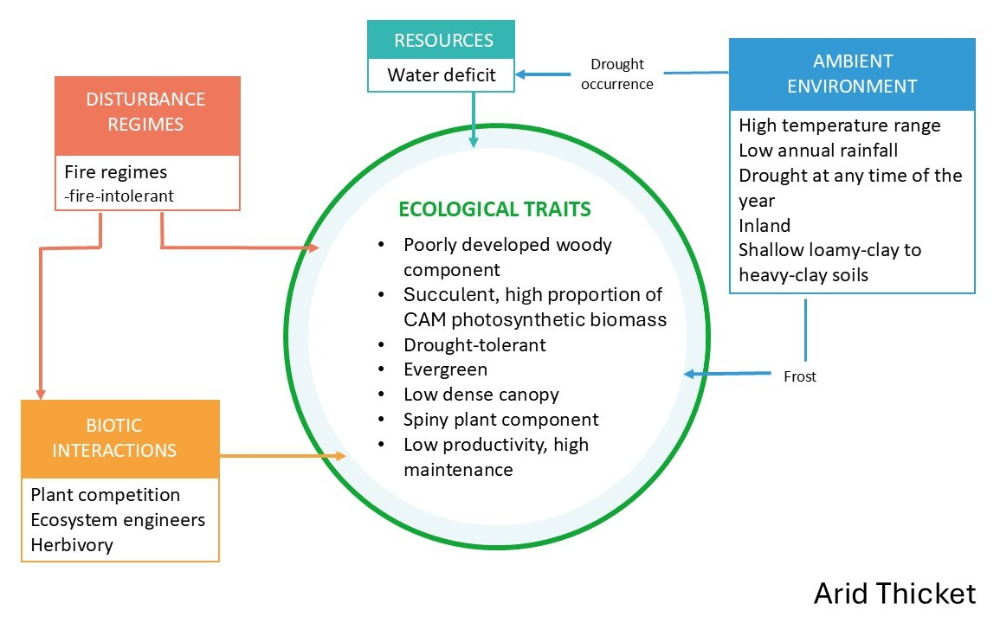
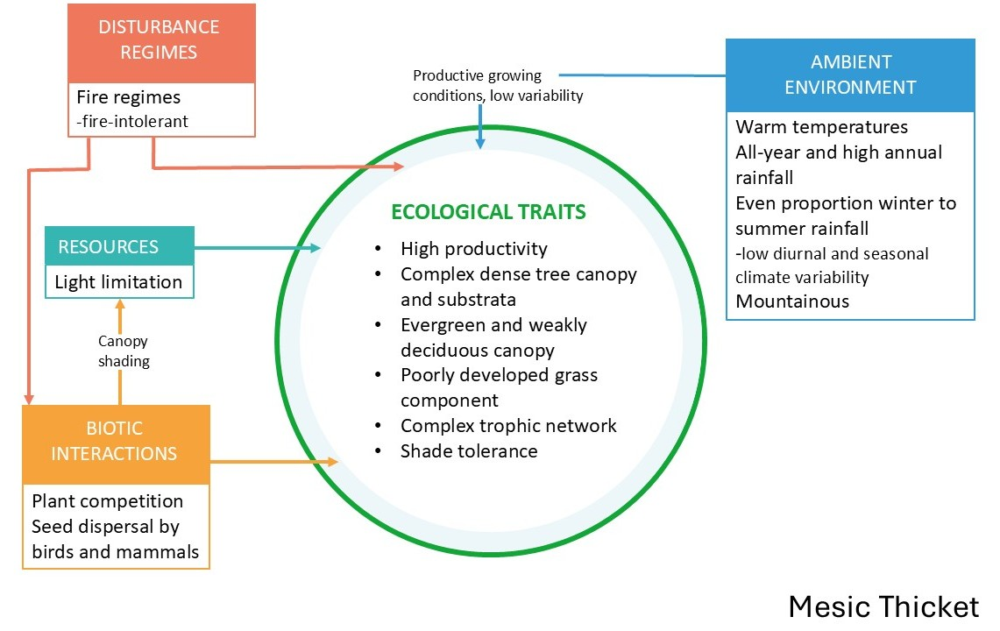
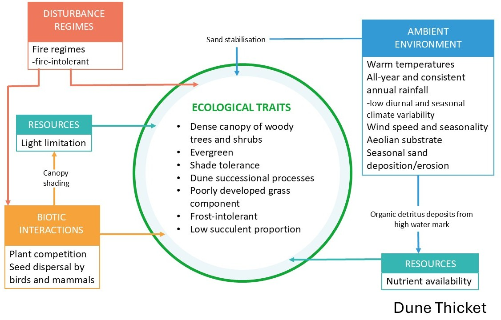

## Ecological Context

### Vegetation units

The Thicket Biome is a structurally complex and compositionally diverse vegetation that occupies a transitional zone between the country's arid interior and its more mesic coastal region[@vlok2002]. Thicket vegetation varies along key environmental gradients of moisture availability, soil type, topography, and rainfall seasonality, giving rise to a variety of growth forms occurring in a mosaic of distinct vegetation clumps [@vlok2003]. The Albany Thicket Biome is notable for maintaining high standing woody biomass and relatively carbon-rich soils despite occurring in semi-arid to arid climates, alongside exceptional diversity of plant growth forms and many endemic taxa[@cowling2005]. Albany Thicket is recognised as a centre of plant endemism, the Albany Centre of Endemism, and forms part of the Maputaland-Pondoland-Albany biodiversity hotspot. Intact thicket tends to be structurally dense and comparatively stable through drought, showing less short-term fluctuation in biomass than many other arid systems, an important property when distinguishing natural variability from degradation signals.

Herbivory is a defining ecological driver in Albany Thicket. Historically the biome supported a diverse herbivores, from small antelope to megaherbivores. While intact thicket can be resilient to natural levels of indigenous browsing, elevated herbivore pressure, especially where animals concentrate, can push the system into a degraded, open-canopy state with slow recovery[@lechmere-oertel2008]. This sensitivity is strongly shaped by context, including water availability (natural or artificial), accessibility and topography, and the distribution of grazing/browsing across the landscape, all of which need to be considered when interpreting condition patterns and planning restoration.

We summarised the "intact" ecosystem functioning of the four main bioregions as conceptual functional models under each description below.

### Valley Thicket (river systems and topographic hollows)

Valley Thicket is associated with major river corridors and sheltered hollows where soils are relatively fertile (often shale-derived) and moisture availability is higher than surrounding slopes. Intact Valley Thicket supports a rich mix of woody and succulent species, often forming a tall, closed canopy with pronounced vertical layering and a buffered microclimate beneath (Fig. 1). Because it occupies mesic pockets within a broader semi-arid setting, it can appear comparatively stable across seasons and drought years, with condition changes often linked to chronic browsing.

{width="522"}

### Arid Thicket (interior valleys and escarpment foothills)

Arid Thicket dominates the drier interior valleys and escarpment foothills where rainfall is low and erratic and water limitation strongly shapes ecosystem structure. Intact Arid Thicket (Fig. 2) is typically characterised by a prominent succulent component and a variable, sometimes less continuous woody layer, with communities often dominated by *Portulacaria afra* (Spekboomveld) or by other succulents such as *Euphorbia* species (e.g., Noorsveld). Because these systems are strongly shaped by chronic grazing pressure and slow regeneration of key canopy-forming species, degradation often presents as loss of canopy cohesion, reduced succulent cover, and increasing bare ground and erosion risk. Once the structural “solid thicket” state is disrupted, recovery requirs active restoration interventions.

{width="487"}

### Mesic Thicket (fire-protected refugia in higher rainfall zones)

Mesic Thicket occurs in regions with moderate to higher, more reliable rainfall, typically persisting in fire-protected refugia such as deep valleys, south-facing slopes, and rocky settings where fire penetration is limited. Intact Mesic Thicket (Fig. 3) forms a dense, stratified canopy of evergreen and weakly deciduous shrubs and trees, often structurally and functionally resembling low forest, with high canopy cover, shaded understories, and strong soil protection. These thicket patches play an important role in regulating erosion, maintaining cool and moist microsites, and storing carbon in woody biomass and soils. Degradation is frequently expressed as canopy opening, loss of palatable shrubs, and edge expansion by fire or clearing, with recovery often slow where the canopy structure has been broken.

### Dune Thicket (coastal fringe)

Dune Thicket occurs along the coastal margin on deep aeolian sands, where plants experience strong winds, salt spray, shifting substrates, and frequent disturbance. Intact Dune Thicket (Fig. 4) typically forms a dense, wind-pruned woody canopy with strong lateral growth, creating sheltered microsites that stabilise sand and support high structural complexity at fine scales. Compared to inland thicket types it generally has fewer succulents, with species and growth forms adapted to burial, abrasion, and nutrient-poor sandy soils. These systems commonly occur as mosaics with coastal fynbos, and patches of forest in sheltered ravines, making landscape context important when interpreting condition.

### Thicket mosaics with other biomes

All thicket bioregions also occur as mosaics with neighbouring biomes and vegetation types, forming patchy landscapes where thicket clumps, shrublands, grasslands, karoo vegetation, forests, wetlands, or riparian zones mix. These mosaics are ecologically meaningful rather than “messy noise” and reflect environmental gradients, disturbance history, and land-use legacies. For mapping, this means reference conditions and expected variability should be defined within comparable landscape contexts, and “intactness” should be evaluated relative to the appropriate thicket–mosaic setting rather than a single idealised thicket state.

### Key pressures in Thicket

The degradation of Thicket has been ongoing for over a century. Historical accounts of vast areas of dense, thorny and impenetrable vegetation, are rarely seen today. Other than outright habitat loss due to urban development and croplands, the replacement of indigenous megaherbivores (like elephants) with high densities of domestic stock has caused severe degradation of the natural landscapes[@lechmere-oertel2008]. Historical overstocking of livestock has thus likely been the primary driver of vegetation change in the arid parts of this biome over the past 200 years, outweighing natural climatic fluctuations​. Inside protected areas such as Addo Elephant National Park, browsing by indigenous herbivores, especially elephants, also impacts thicket structure (e.g. converting tall thicket to a shorter, more open state), but this is a more localised effect compared to the widespread clearing for citrus planting or unsustainable herbivory by livestock in rangelands. Outside these refuges, many thicket landscapes are in various stages of degradation, with reduced shrub or succulent cover, altered species composition, and diminished ecological function (lower carbon stocks and soil stability), often being indicators of degradation.

{width="727"}

The Thicket biome faces increasing pressure from anthropogenic activities, particularly chronic browsing by livestock such as goats or extralimital game species, which has led to severe degradation, such as loss of key plant species and canopy cover, increasing grass cover and soil erosion in many areas. Continued selective grazing often leads to a transition from palatable perennial species to unpalatable and short-lived species. Soil erosion, largely driven by unsustainable herbivory, contributes to the loss of topsoil and further diminishes the ecological integrity of these areas by reducing regenerative capacity, ultimately resulting in carbon loss[@mills2005]. Additionally, climate change poses a long-term threat to the Thicket biome, with shifts in temperature and precipitation patterns potentially altering the distribution and composition of vegetation, as climatic niches shift. Droughts in particular are predicted to increase in South Africa, and pose a major threat to the ecological condition of Thicket. While invasive species do not cover a large extent of the biome, localised dense cover of species such as Australian wattles and *Opuntia* species, further exacerbate degradation by outcompeting native vegetation and changing ecosystem processes through altered nutrient cycling, hydrology and fire regimes[@kraaij2022].

{width="745"}

## Remote sensing approach

Because of the evergreen nature of intact Thicket vegetation, remote sensing approaches to ecosystem condition mapping is a feasible option. Since the key pressures is historical (but also present) unsustainable livestock farming and ranching, it is possible to detect the resulting impact of loss in vegetation cover and subsequent increase in persistent bare soil cover with satellite imagery. In other words, if we mask the transformed land cover categories, we can focus on rangelands which cover most of the biome. Persistent loss of perennial vegetation cover can then serve as a proxy for unsustainable herbivory. The legacy of degradation research (see [STEP](https://bgis.sanbi.org/STEP/project.asp)) in the biome provides a strong foundation for understanding ecosystem condition and key pressures [@vlok2002][@lechmere-oertel2008][@mills2005]. Coupled with the recent demand for scientifically grounded ecosystem condition data to prioristise restoration activities[@mills2023], Albany Thicket provided an ideal first case study to our SBAPP project (Fig. 1).

## **Results**

The mapped results of ecosystem condition can be browsed in this [Google Earth Engine App](https://ee-stephnivdm.projects.earthengine.app/view/thicket-ecological-condition), although it is still under review.

## Methods

### Training data

The SBAPP project views ecological condition as a continuum from transformed (habitat loss) to intact. Training data thus consisted of collated data set of condition-labelled points assigned through expert interpretation and known field-validated examples of Thicket vegetation in different states of degradation (i.e. grazing or browsing pressure) along fence-line contrasts and across the east-west environmental gradients. Additional training points were also targeted in piospheres around artificial watering points with clear structural changes with browsing pressure, and along fence-line contrasts because these locations provide strong, unambiguous signals of herbivore-driven degradation. The close spatial pairing of fence-line contrasts and piospheres reduces confounding environmental variability and increases the confidence that observed vegetation differences are primarily the result of land use rather than underlying abiotic gradients. Transformed points were manually digitised within transformed land cover classes in Google Earth Engine using the basemap. Points were classified into four condition classes: intact, moderate, severe, and transformed.

Ecological interpretation of the classes followed the state-and-transition framework used for Albany Thicket by Thompson et al. (2009) [@thompson2009] and Lechmere-Oertel (2023)[@lechmere-oertel2023] as follows:

1\. Intact

Ecologically intact sites represent closed-canopy, structurally complete succulent/woody Thicket. These areas maintain the full complement of dominant woody species (e.g., *Portulacaria afra*, *Euclea undulata*, *Pappea capensis*), a deep litter layer, high aboveground biomass, and well-buffered microclimates. Soil surfaces are mostly shaded, erosion is minimal, and nutrient cycling remains functional. These sites correspond to the “untransformed” or “near-reference” state, showing no evidence of sustained herbivory-driven collapse.

2\. Moderate degradation

Moderately degraded Thicket exhibits partial canopy loss and early signs of structural simplification. Palatable shrubs decline but some Thicket clumps remain intact. The soil surface begins to experience intermittent exposure, ephemeral grasses, encroacher or invasiv shrubs increase in frequency, and the litter layer becomes discontinuous. This state aligns with the intermediate transition phase in Thompson et al. (2009)'s condition gradient, where degradation is evident but reversible if grazing pressure is reduced.

3\. Severe degradation

Severely degraded Thicket shows advanced canopy collapse, dominated by pseudo-savanna elements such as annual grasses, *Pentzia incana*, *Galenia* spp., and scattered remnant shrubs persisting only above the browse line. The original Thicket structure is largely lost, soil surfaces are exposed and crusted, and erosion scars are common. Nutrient cycling and microclimatic buffering have broken down. This corresponds to the high-degradation state of Thompson et al. (2009), where functional thresholds have been crossed and passive recovery is unlikely.

4\. Transformed

Transformed sites represent areas where Thicket has been completely removed by ploughing, orchards, croplands, urban development, mining, or other land-cover conversion. Ecologically, these areas no longer retain Thicket structure, species composition, or processes. In short, this class is where Thicket has lost habitat by direct human transformation.

### Predictor variables

Predictor variables were derived from the Google AlphaEarth Foundation satellite embeddings 10 m resolution annual dataset (available 2017-2024). Embeddings provide a way to compress large volumes of remote-sensing information into a compact set of features that may capture meaningful ecological and spatial patterns[@brown]. The AlphaEarth Foundation Model integrates multi-temporal imagery from open access sensors such as Sentinel-2, Sentinel-1 and Landsat, Land Cover data, elevation and learns a shared representation of the information contained across these sources. This allows each pixel’s spectral, spatial and temporal characteristics to be summarised in a small embedding vector of 64 values, that captures the key mutual information between the different sensors and the underlying landscape. Embedding values were sampled at each training point, which formed the input into a Random Forest model.

### Random Forest modelling

A supervised Random Forest (RF) regression model was trained separately for Arid, Valley, and Mesic Thicket using AlphaEarth embeddings as predictors and condition-labeled training data. The models were fitted using 300 trees with class-balanced sampling. Instead of mapping a single “best” class from the Random Forest, we use the model’s per-class probabilities for four states: intact, moderately degraded, severely degraded, and transformed (i.e., the probability the pixel belongs to each class). We then collapse these into one continuous 0–1 condition score with a weighted sum, for example: Score = 1·P(intact) + 0.66·P(moderate) + 0.33·P(severe) + 0·P(transformed). Because the probabilities sum to 1, this score is automatically bounded between 0 and 1, where values close to 1 indicate high confidence of intact condition and values close to 0 indicate high confidence of transformed or severely degraded condition. The numeric scaling facilitates downstream analyses, comparison across bioregions, and integration with condition frameworks, which require a continuous measure of relative degradation intensity. The final condition gradient was exported at 10 m resolution for expert review.

### Model validation

Model performance was evaluated using a combination of internal cross-validation and independent expert-mapped degradation maps. First, the condition-labelled points were randomly partitioned into an 80/20 train-test split, stratified by condition class to retain balanced representation of intact, moderate, severe and transformed sites. The model was trained on the 80% subset and predictions were evaluated against the held-out 20% using overall accuracy, class-specific precision and recall, and confusion matrices to quantify how well the RF distinguished different degradation states. To provide an external, ecologically independent assessment of model realism, we further validated predictions against farm-level degradation maps supplied by Thicket experts, mapped between 2020-2022, which contain spatially explicit delineations of moderate and severely degraded and intact areas. Points were randomly placed in areas that overlap with the expert-mapped polygons, where the RF predictions values were extracted, and agreement was assessed using mean predicted condition per polygon, class-wise accuracy, and visual consistency with known degradation patterns.

### Key resources

Ecosystem guidelines, thicket vegetation research and links to important papers can be found at the [Thicket Forum's website](https://www.thicketforum.org.za/resources/knowledge).

The findings of this case study are being prepared as a manuscript.

## References

::: {#refs}
:::
