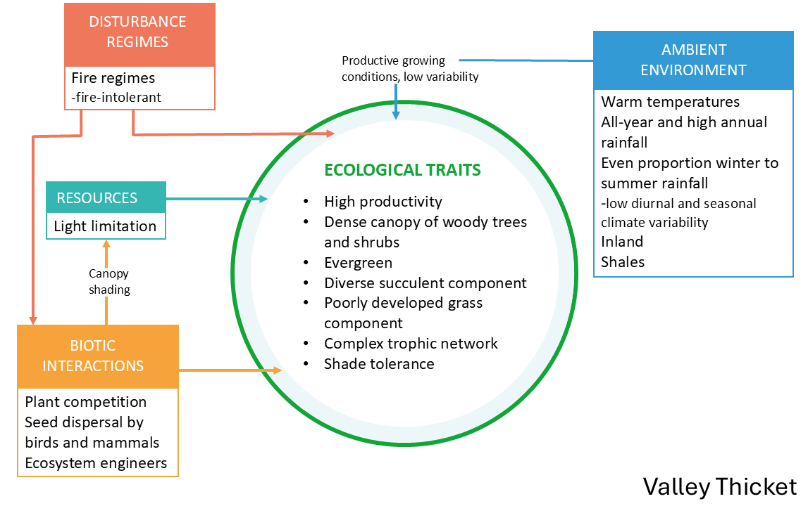
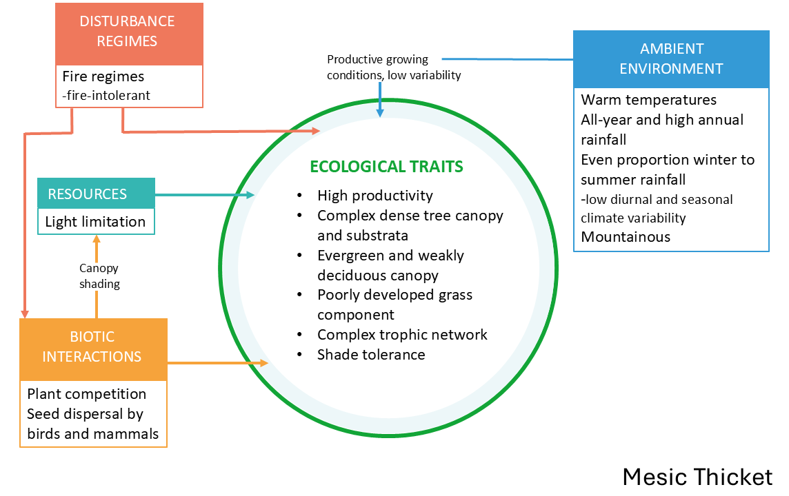
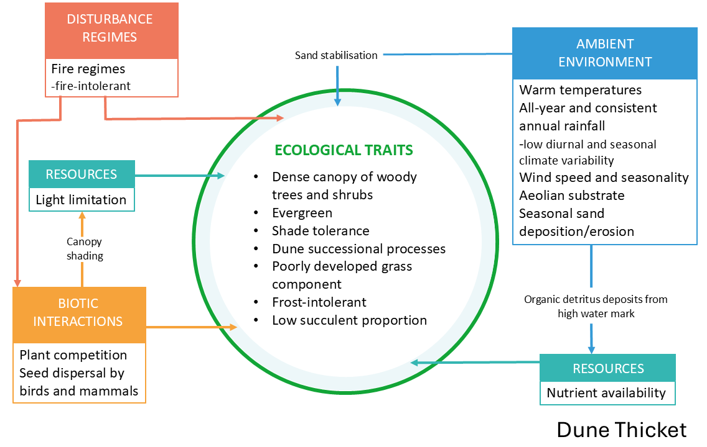
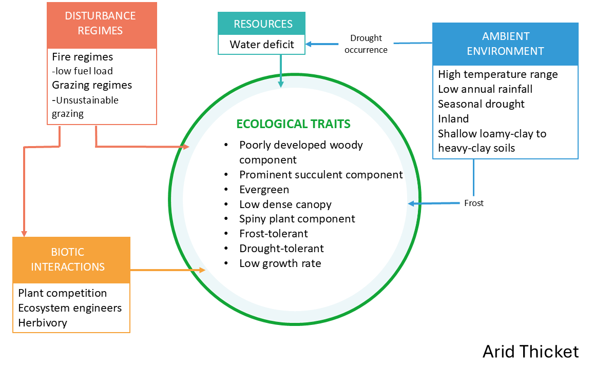

## Ecological Context

### Vegetation units

The Albany Thicket Biome is a structurally complex and compositionally diverse vegetation that occupies a transitional zone between the country's arid interior and its more mesic coastal regions. Thicket vegetation varies along key environmental gradients of moisture availability, soil type, topography, and rainfall seasonality, giving rise to a variety of growth forms occurring in a mosaic of distinct vegetation clumps. Intact solid Thicket vegetation, i.e. untransformed and not in mosaics or bush clumps, is characterised by its resilience to certain disturbances, such as fire and herbivory, due to its dense near-impenetrable canopy and thorny structure. However, this resilience comes at a cost: once disturbed, Thicket vegetation exhibits a low regenerative capacity, often failing to return to its original stable state or requiring decades for recovery of the slow-growing species. This has significant implications for conservation, as the remaining intact Thicket needs to be prioritised for protection, and degraded sites actively restored where possible. Indeed, restoration efforts in the Thicket has shown remarkable success when given space and time for recovery in protected sites.

{width="967"}

At the bioregion-level, along the coastal fringe, Dune Thicket occurs on aeolian sands with high wind exposure and saline influences. This vegetation is characterised by a dense woody canopy, low succulent presence, and species adapted to sand stabilisation and frequent disturbance. Inland from the coast, Valley Thicket is found along major river systems and in topographic hollows with elevated soil moisture and fertile, shale-derived soils. These systems support a rich assemblage of woody and succulent species and are notable for their resistance to seasonal climatic fluctuations. In regions with moderate, year-round rainfall, Mesic Thicket occupies fire-protected topographic refugia such as deep valleys and southern slopes. It forms a dense, stratified canopy of evergreen and weakly deciduous shrubs and trees similar to forest vegetation, and plays a critical role in soil retention and carbon sequestration. By contrast, Arid Thicket dominates the interior valleys and escarpment foothills, where rainfall is low and erratic, and vegetation is shaped by chronic water deficit, nutrient-poor soils, and intense grazing pressure. Arid Thicket is distinguished from other thicket forms by a poorly developed woody component and a prominent succulent layer, with communities being either dominated by *Portulacaria afra* (eg. in Spekboomveld) or by other succulents (eg. in Noorsveld). All the bioregions also occur in mosaics with other biomes.

{width="437"}

{width="446"}

{width="449"}

{width="446"}

### Key pressures in Thicket

The degradation of Thicket has been ongoing for over a century. Historical accounts of vast areas of dense, thorny and impenetrable vegetation, are rarely seen today. Other than outright habitat loss due to urban development and croplands, the replacement of indigenous megaherbivores (like elephants) with high densities of domestic stock has caused severe degradation of the natural landscapes. Historical overstocking of livestock has thus likely been the primary driver of vegetation change in the arid parts of this biome over the past 200 years, outweighing natural climatic fluctuations​. Inside protected areas such as Addo Elephant National Park, browsing by elephants also impacts thicket structure (e.g. converting tall thicket to a shorter, more open state), but this is a more localised effect compared to the widespread clearing for citrus planting or unsustainable herbivory in rangelands. Outside these refuges, many thicket landscapes are in various stages of degradation, with reduced shrub or succulent cover, altered species composition, and diminished ecological function (lower carbon stocks and soil stability), often being indicators of degradation.

The Thicket biome faces increasing pressure from anthropogenic activities, particularly overgrazing/browsing by livestock such as goats or extralimital game species, which has led to severe degradation, such as loss of key plant species and canopy cover, increasing grass cover and soil erosion in many areas. Soil erosion, largely driven by unsustainable herbivory, contributes to the loss of topsoil and further diminishes the ecological integrity of these areas by reducing regenerative capacity, ultimately resulting in carbon loss. Additionally, climate change poses a long-term threat to the Thicket biome, with shifts in temperature and precipitation patterns potentially altering the distribution and composition of vegetation, as climatic niches shift. Droughts in particular are predicted to increase in South Africa, and pose a major threat to the ecological condition of Thicket. While invasive species do not cover a large extent of the biome, localised dense cover of species such as Australian wattles and *Opuntia* species, further exacerbate degradation by outcompeting native vegetation and changing ecosystem processes through altered nutrient cycling, hydrology and fire regimes.

### **Thicket collaborators**

Prof. Alastair Potts (Nelson Mandela University), Prof. Anthony Palmer (Rhodes University) and Dr. Michael Powell (Rhodes University) assisted the SBAPP project team for the Albany Thicket biome.
