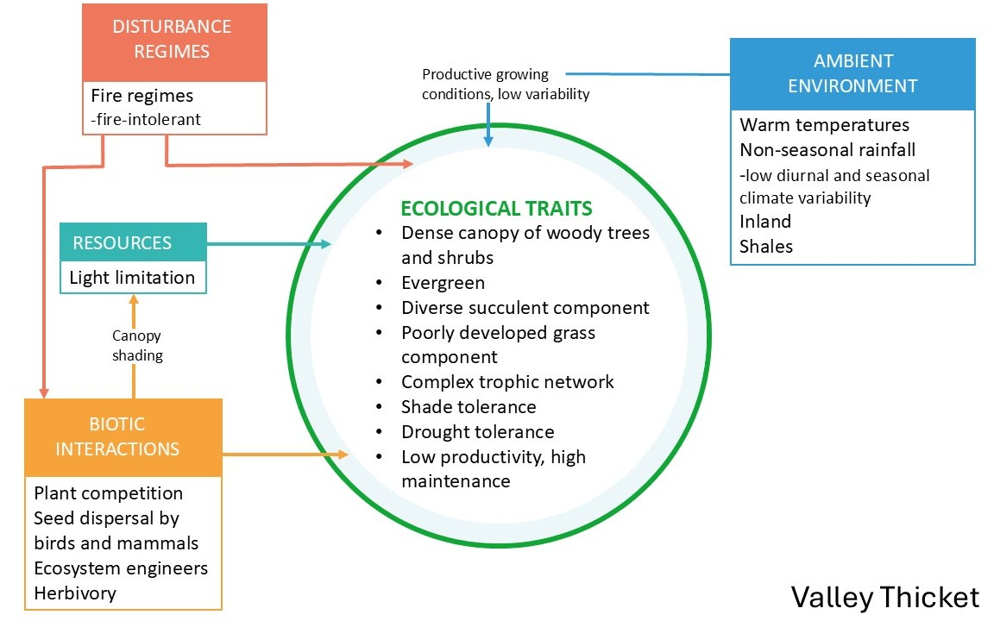
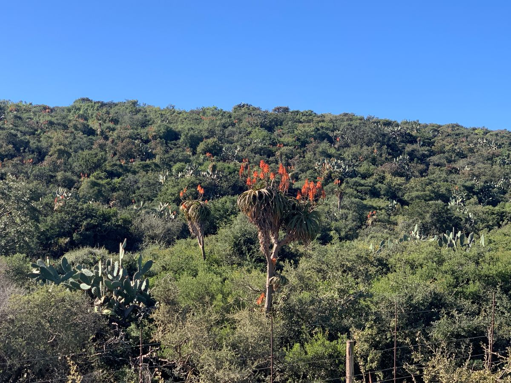
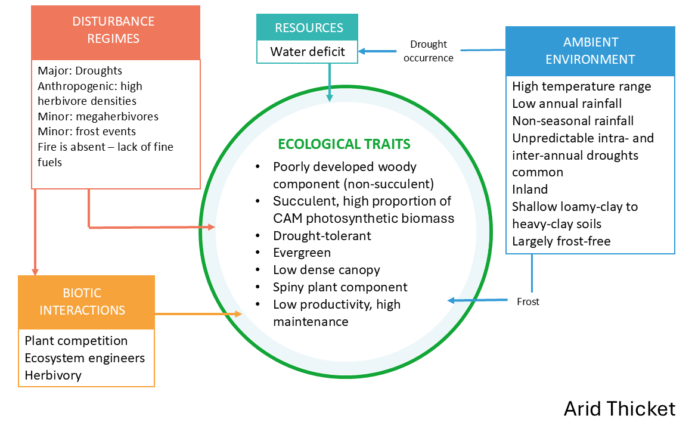
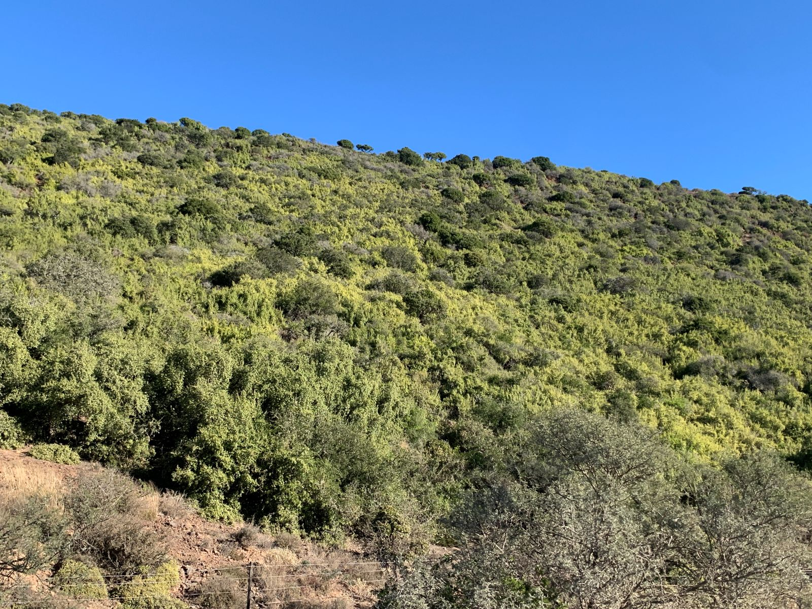
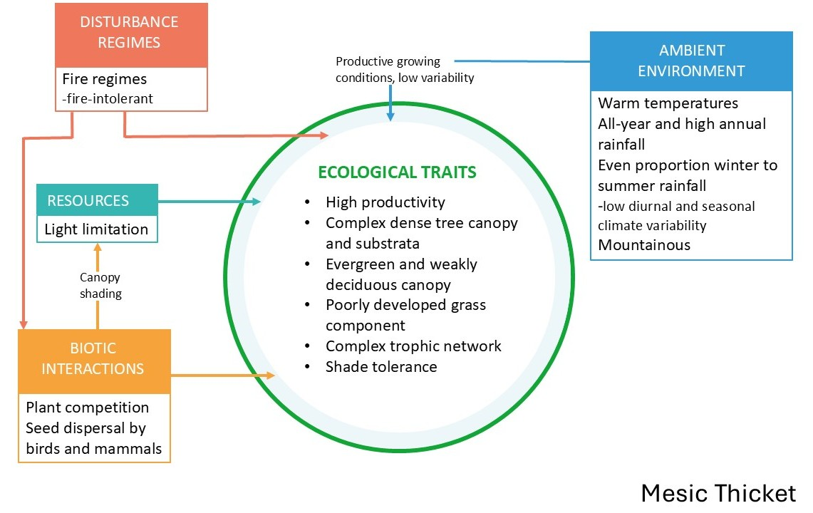
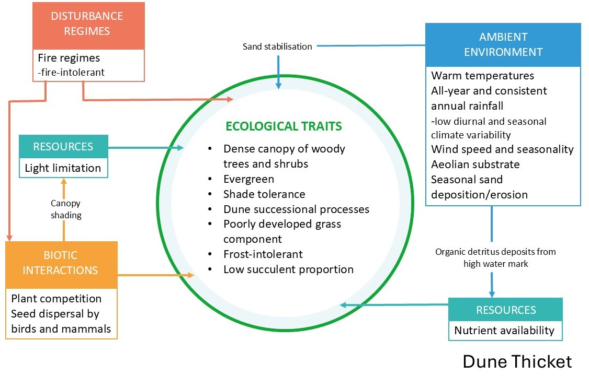
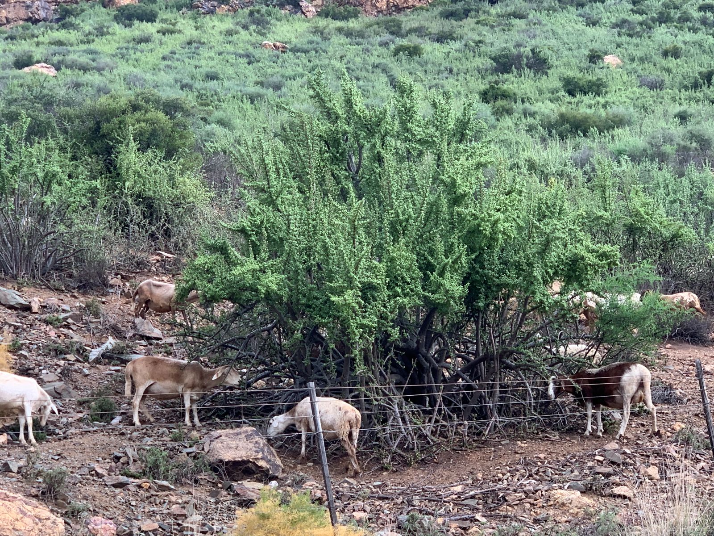
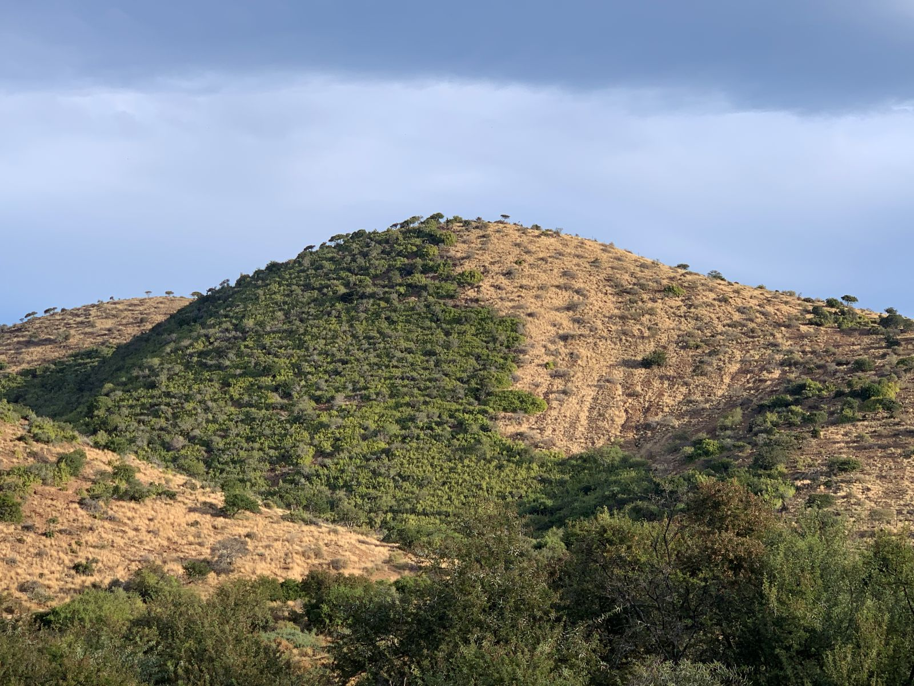
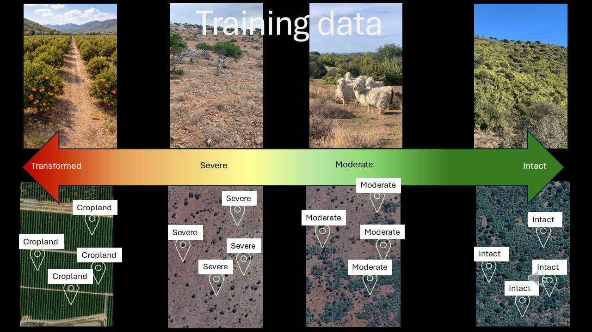

::: callout-note
Important: The ecosystem condition assessments for this biome are still in progress. We thus provide the summary of our approach and preliminary results (peer review is still underway). The findings of this case study are being prepared as a manuscript together with Thicket experts and must not be interpreted as the final results.
:::

## Summary of findings

Much of the degradation in Albany Thicket occurred before satellite monitoring and modern national land cover datasets became available. Because these datasets mainly identify recent (post-1980s) conversion to artificial land covers, areas degraded long ago may still be classified as natural, leaving substantial variation in ecological condition unrepresented in biodiversity assessments. To close this gap, our approach combines expert ecological knowledge with remote sensing and machine learning: experts co-defined the natural reference and degraded states and provided condition-labelled observations using space-for-time substitutes along fence-line contrasts and herbivory gradients, while the models extended these ecological interpretations across solid Arid, Mesic and Valley Thicket. The resulting maps can be explored in the [Google Earth Engine App](https://ee-stephnivdm.projects.earthengine.app/view/thicket-ecological-condition).

Preliminary area estimates showed clear differences among the ecosystem groups. Of the 800,340 ha assessed in **Arid Thicket, only 79,080 ha (9.9%) was classified as intact**, 548,898 ha (68.6%) as severely degraded, 162,036 ha (20.2%) as moderately degraded, and 10,326 ha (1.3%) as transformed. Of the 291,534 ha assessed in Mesic Thicket, 146,507 ha (50.3%) was classified as intact, 76,031 ha (26.1%) as moderately degraded, 42,665 ha (14.6%) as severely degraded and 26,331 ha (9.0%) as transformed. Valley Thicket had a more even distribution: of the 906,463 ha assessed, 310,158 ha (34.2%) was classified as severely degraded, 283,744 ha (31.3%) as intact, 255,391 ha (28.2%) as moderately degraded and 57,170 ha (6.3%) as transformed. These direct pixel counts are being compared with design-based estimates that account for classification error (see [Venter et al. 2024](https://www.sciencedirect.com/science/article/pii/S2212041624000056?via%3Dihub)). The resulting condition data can help prioritise protected area expansion and restoration, including identifying degraded areas where spekboom planting is ecologically appropriate, while also supporting ecosystem red-listing and accounting.

![A permanent restoration plot near Kleinpoort, Eastern Cape, established in 2008/2009 to support long term monitoring of spekboom planting and the recovery in severely degraded Arid Thicket vegetation, here resembling a "pseudo-Savanna" state once palatable species were removed by chronic browsing. Only trees above the browse-line survive within a matrix of non-native ephemeral species in the areas surrounding the restoration plot. Notice the pink *Mesembryanthemum* species, an indicator of degradation in Arid Thicket vegetation, flowering after the first rainfall following a drought. The flowering event in 2023 was even visible in satellite imagery. (©Alastair Potts)](imgs/plot.png)

## Introduction

Reliable information on ecosystem condition is increasingly needed to guide conservation, restoration and environmental reporting. Land cover maps can show where natural vegetation has been converted to croplands, settlements or other land uses, but they often do not detect degradation within vegetation that remains classified as "natural". Ecosystem condition assessments address this gap by evaluating how much of an ecosystem’s characteristic composition, structure and functioning remains within the "natural" land cover and how much is considered degraded. This information is needed to identify intact areas requiring protection, locate degraded areas suitable for restoration, and measure progress towards national and international biodiversity targets.

This need is particularly urgent in Albany Thicket, where long-term browsing has degraded large areas and interest in *Portulacaria afra* (spekboom) restoration has grown rapidly[@mills2023a]. Carbon-credit markets could provide substantial funding for restoration, but credible projects require reliable baseline information, appropriate site selection and long-term monitoring of ecological recovery. Spatial condition data can help distinguish areas where intact thicket should be protected, where reducing pressures may allow recovery, and where active intervention may be necessary. Importantly, spekboom planting should be directed towards degraded ecosystems **in which the species formed part of the natural reference vegetation, rather than applied uniformly across the biome.**

## Ecological Context

### Vegetation units

The Thicket Biome is a structurally complex and compositionally diverse vegetation that occupies a transitional zone between the country's arid interior and its more mesic coastal region[@vlok2002]. Thicket vegetation varies along key environmental gradients of moisture availability, soil type, topography, and rainfall seasonality, giving rise to a variety of growth forms occurring in a mosaic of distinct vegetation clumps [@vlok2003]. The Albany Thicket Biome is notable for maintaining high standing woody biomass and relatively carbon-rich soils despite occurring in semi-arid to arid climates, alongside exceptional diversity of plant growth forms and many endemic taxa[@cowling2005]. Albany Thicket is recognised as a centre of plant endemism, the Albany Centre of Endemism, and forms part of the Maputaland-Pondoland-Albany biodiversity hotspot. Intact thicket tends to be structurally dense and comparatively stable through drought, showing less short-term fluctuation in biomass than many other arid systems, an important property when distinguishing natural variability from degradation signals.

Herbivory is a defining ecological driver in Albany Thicket. Historically the biome supported diverse herbivores, from small antelope to megaherbivores. While intact thicket can be resilient to natural levels of indigenous browsing, elevated herbivore pressure, especially where animals concentrate, can push the system into a degraded, open-canopy state with slow recovery[@lechmere-oertel2008]. This sensitivity is strongly shaped by context, including water availability (natural or artificial), accessibility and topography, and the distribution of grazing/browsing across the landscape, all of which need to be considered when interpreting condition patterns and planning restoration.

We summarised the "intact" ecosystem functioning of the four main ecosystem groups as conceptual functional models under each description below.

### Valley Thicket (river systems and topographic hollows)

Valley Thicket is associated with major river corridors and sheltered hollows where soils are relatively fertile (often shale-derived) and moisture availability is higher than surrounding slopes. Intact Valley Thicket supports a species rich mix of woody and succulent species, often forming a tall, closed canopy with pronounced vertical layering and a buffered microclimate beneath (Fig. 1). Because it occupies mesic pockets within a broader semi-arid setting, it can appear comparatively stable across seasons and drought years, with condition changes often linked to chronic browsing.

{width="522"}

### Arid Thicket (interior valleys and escarpment foothills)

Arid Thicket dominates the drier interior valleys and escarpment foothills where rainfall is low and erratic and water limitation strongly shapes ecosystem structure. Intact Arid Thicket (Fig. 2) is typically characterised by a prominent succulent component and a variable, sometimes less continuous woody layer, with communities often dominated by *Portulacaria afra* (Spekboomveld) or by other succulents such as *Euphorbia* species (e.g., Noorsveld). Because these systems are strongly shaped by chronic grazing pressure and slow regeneration of key canopy-forming species, degradation often presents as loss of canopy cohesion, reduced succulent cover, and increasing bare ground and erosion risk. Once the structural “solid thicket” state is disrupted, recovery requirs active restoration interventions.

{width="487"}

### Mesic Thicket (fire-protected refugia in higher rainfall zones)

Mesic Thicket occurs in regions with moderate to higher, more reliable rainfall, typically persisting in fire-protected refugia such as deep valleys, south-facing slopes, and rocky settings where fire penetration is limited. Intact Mesic Thicket (Fig. 3) forms a dense, stratified canopy of evergreen and weakly deciduous shrubs and trees, often structurally and functionally resembling low forest, with high canopy cover, shaded understories, and strong soil protection. These thicket patches play an important role in regulating erosion, maintaining cool and moist microsites, and storing carbon in woody biomass and soils. Degradation is frequently expressed as canopy opening, loss of palatable shrubs, and edge expansion by fire or clearing, with recovery often slow where the canopy structure has been broken.

### Dune Thicket (coastal fringe)

Dune Thicket occurs along the coastal margin on deep aeolian sands, where plants experience strong winds, salt spray, shifting substrates, and frequent disturbance. Intact Dune Thicket (Fig. 4) typically forms a dense, wind-pruned woody canopy with strong lateral growth, creating sheltered microsites that stabilise sand and support high structural complexity at fine scales. Compared to inland thicket vegetation types it generally has fewer succulents, with species and growth forms adapted to burial, abrasion, and nutrient-poor sandy soils. These systems commonly occur as mosaics with coastal fynbos, and patches of forest in sheltered ravines, making landscape context important when interpreting condition.

### Thicket mosaics with other biomes

All thicket bioregions also occur as mosaics with neighbouring biomes and vegetation types, forming patchy landscapes where thicket clumps, shrublands, grasslands, karoo vegetation, forests, wetlands, or riparian zones mix. These mosaics are ecologically meaningful rather than “messy noise” and reflect environmental gradients, disturbance history, and land-use legacies. For mapping, this means reference conditions and expected variability should be defined within comparable landscape contexts, and “intactness” should be evaluated relative to the appropriate thicket–mosaic setting rather than a single idealised thicket state.

## Key pressures in Thicket

-   **Chronic overbrowsing (primary pressure)**\
    The dominant driver of thicket degradation is long-term, repeated browsing, especially by high densities of domestic stock (goats) or extralimital game. Sustained browsing opens the formerly dense canopy, removes palatable shrubs and succulents (notably *Portulacaria afra* in Spekboomveld), and exposes bare soil[@lechmere-oertel2005]. This can trigger a shift from a resilient, closed-canopy “solid thicket” state to a more open, degraded state with slow or limited natural recovery, particularly once topsoil is lost and seedling establishment fails. Canopy opening and trampling increase runoff and erosion, leading to topsoil loss, reduced infiltration, and declining soil stability. Because thicket stores substantial carbon in woody biomass and soils, degradation commonly results in reduced carbon stocks and diminished ecosystem functioning, reinforcing a negative feedback where poor soils further limit regeneration[@mills2005].

-   **Concentrated browsing by indigenous megaherbivores (localised but important in refuges)**\
    In protected areas, elephants and other browsers can modify thicket structure, sometimes shifting tall thicket into a shorter, more open form. This is typically spatially localised compared to widespread rangeland degradation, but it can be significant for interpreting patterns inside reserves and for separating management-driven structural change from livestock-driven collapse.

-   **Invasive alien plants (generally localised, but can intensify impacts)**\
    While invasive plants may not dominate the biome’s total area, dense invasions (e.g., Australian wattles, *Opuntia* spp.) can locally suppress native regeneration and alter hydrology and nutrient cycling. In heavily browsed landscapes, invasives can further shift the system away from thicket recovery trajectories.

## Expert-guided remote sensing approach

Thicket ecologists who have worked in the same ecosystems for many years, accumulate knowledge and a deep understanding of ecosystem condition. Combining this knowledge with satellite imagery and machine learning, may provide a powerful approach to better map ecosystem condition. Albany Thicket is particularly well suited to testing this approach. First, the legacy of degradation research (see [STEP](https://bgis.sanbi.org/STEP/project.asp)) in the biome provides a strong foundation for understanding ecosystem condition and key pressures [@vlok2002][@lechmere-oertel2008][@mills2005]. Second, unlike South Africa’s strongly seasonal grasslands, intact Thicket remains evergreen for much of the year, and fire is not part of its natural disturbance regime. Changes detected in satellite imagery are therefore less likely to reflect normal seasonal cycles or fire and be mistaken for degradation.

Third, because passive recovery in Arid Thicket vegetation is unlikely or extremely slow once it has been heavily degraded by chronic browsing, the impacts from the past (prior to satellite monitoring became available *c.* 1980s) are still easily detectable using space-for-time substitutes: fence lines contrasts where one side of the fence has been heavily browsed and the other side not (Fig, 5b). We can also observe this along gradients extending from livestock watering points (Fig. 6). Because these neighbouring areas experience similar rainfall, soils and topography, differences in their vegetation can be linked more confidently to browsing pressure.

Decades of field research and knowledge accumulated by local ecologists therefore provided a strong basis for testing whether expert interpretation and satellite imagery can be combined to identify degradation that conventional land cover maps may overlook. Coupled with the recent demand for scientifically grounded ecosystem condition data to prioristise restoration activities[@mills2023], Albany Thicket provided an ideal first case study to our SBAPP project (Fig. 5).

## Methods

### Training data

The SBAPP project views ecological condition as a continuum from transformed habitat to an intact reference state (Fig. 7). Within remaining natural vegetation, mostly used as rangelands, the modelling used three expert-interpreted condition classes: intact, moderately degraded and severely degraded. Training data comprised condition-labelled points collated from field-validated examples and/or expert interpretation across the east-west environmental gradient. Points targeted piospheres around artificial watering points and fence-line contrasts with clear structural changes associated with browsing pressure. The close spatial pairing of these contrasts helps reduce confounding environmental variability and increases confidence that observed vegetation differences primarily reflect land use rather than underlying abiotic gradients. Areas converted to agriculture, settlements, mines, plantations and other transformed land covers were identified separately from the South African National Land Cover 2022 dataset and were excluded from model training and prediction.

Ecological interpretation of the classes followed the state-and-transition framework used for Albany Thicket by Thompson et al. (2009) [@thompson2009] and Lechmere-Oertel (2023)[@lechmere-oertel2023] as follows:

1\. Intact

Ecologically intact sites represent closed-canopy, structurally complete succulent/woody Thicket. These areas maintain the full complement of dominant woody species (e.g., *Portulacaria afra*, *Euclea undulata*, *Pappea capensis*), a deep litter layer, high aboveground biomass, and well-buffered microclimates. Soil surfaces are mostly shaded, erosion is minimal, and nutrient cycling remains functional. These sites correspond to the “untransformed” or “near-reference” state, showing no evidence of sustained herbivory-driven collapse.

2\. Moderate degradation

Moderately degraded Thicket exhibits partial canopy loss and early signs of structural simplification. Palatable shrubs decline but some Thicket clumps remain intact. The soil surface begins to experience intermittent exposure, ephemeral grasses, encroacher or invasiv shrubs increase in frequency, and the litter layer becomes discontinuous. This state aligns with the intermediate transition phase in Thompson et al. (2009)'s condition gradient, where degradation is evident but reversible if grazing pressure is reduced.

3\. Severe degradation

Severely degraded Thicket shows advanced canopy collapse, dominated by pseudo-savanna elements such as annual grasses, *Pentzia incana*, *Galenia* spp., and scattered remnant shrubs persisting only above the browse line. The original Thicket structure is largely lost, soil surfaces are exposed and crusted, and erosion scars are common. Nutrient cycling and microclimatic buffering have broken down. This corresponds to the high-degradation state of Thompson et al. (2009), where functional thresholds have been crossed and passive recovery is unlikely.

4\. Transformed

Transformed sites represent areas where Thicket has been completely removed by ploughing, orchards, croplands, urban development, mining, or other land-cover conversion. Ecologically, these areas no longer retain Thicket structure, species composition, or processes. In short, this class is where Thicket has lost habitat by direct human transformation.

### Predictor variables

Predictor variables were derived from the Google AlphaEarth Foundation satellite embeddings 10 m resolution annual dataset (available 2017-2024). Embeddings provide a way to compress large volumes of remote-sensing information into a compact set of features that may capture meaningful ecological and spatial patterns[@brown]. The AlphaEarth Foundation Model integrates multi-temporal imagery from open access sensors such as Sentinel-2, Sentinel-1 and Landsat, Land Cover data, elevation and learns a shared representation of the information contained across these sources. This allows each pixel’s spectral, spatial and temporal characteristics to be summarised in a small embedding vector of 64 values, that captures the key mutual information between the different sensors and the underlying landscape (Fig. 8). Embedding values were sampled at each training point, which formed the input into a Random Forest model.

### Machine learning approach

Supervised Random Forest classifiers were trained separately for Arid, Valley and Mesic Thicket using AlphaEarth embeddings as predictors and the three condition labels as the response, in Google Earth Engine. Model hyperparameters were tuned and selected separately for each ecosystem group using five-fold spatial cross-validation. The final models produce three probability surfaces: P(intact), P(moderate) and P(severe), as well as the most probable class and its probability. These outputs retain information about uncertainty and show where models were split between adjacent condition states. A single continuous condition index is still being evaluated and is therefore not presented here as a final product.

### Model validation

A spatial cross-validation approach was used to estimate model accuracy to account for the spatial autocorrelation in the data. Model performance was evaluated using five-fold spatial block cross-validation rather than a random train-test split. Training samples were assigned to a regular 0.02° spatial grid, and all samples within a grid cell were kept in the same fold. This reduces inflated accuracy estimates caused by spatial autocorrelation and tests whether models can generalise to new areas. We reported overall and balanced accuracy, precision, recall and F1 scores. Uncalibrated probabilities were compared with multinomial, isotonic and temperature-scaled probabilities using spatial out-of-fold predictions; none of the post-hoc calibration methods consistently improved Brier score or log loss, so the uncalibrated Random Forest probabilities were retained. Independent farm-level degradation maps produced by Thicket experts between 2020 and 2022 provided an additional assessment of broad spatial agreement and ecological realism.

### Expert validation and design-based area estimation

We developed an online validation app to test how closely the mapped condition classes agreed with expert ecological interpretation. The predicted ecosystem condition map was divided by ecosystem group and predicted condition class, and validation points were selected at random within every combination. This ensured that intact, moderately degraded and severely degraded predictions were assessed across the different solid-thicket ecosystem types, rather than concentrating validation in the largest or most accessible areas. Experts examined each sampled location and assigned their own condition label. Comparing these expert labels with the model predictions provides a measure of model–expert agreement and helps identify the ecosystem types or condition classes in which predictions are less reliable.

The same probability-based sample provides the reference information needed for design-based area estimation. Simply counting the pixels assigned to each condition class assumes that every model prediction is correct (i.e. no classification errors). Even a model with good overall accuracy will confuse some classes, particularly the less distinct moderate class, and direct pixel counts may therefore overestimate some condition classes while underestimating others. Design-based estimation uses the expert-labelled sample to quantify these classification errors and adjusts the mapped areas according to the proportion of the landscape represented by each sampling group[@venter2024]. This produces accuracy-adjusted estimates of the areas of intact, moderately degraded and severely degraded Thicket, together with confidence intervals that show the remaining sampling uncertainty (a second round of this validation is underway and the first round's results are presented below).

For comparison with the design-based estimates, we also calculated class areas using the conventional pixel-counting approach commonly applied in ecosystem condition accounts[@edens2022]. This involved summing the area of all pixels assigned to each predicted condition class within each ecosystem type.

### Relative ecosystem condition index

For biodiversity planning, we are developing a relative condition index by comparing the satellite-derived characteristics of each pixel with expert-labelled examples of intact and severely degraded vegetation within the same Thicket ecosystem group. The embeddings summarise the satellite information for every pixel as 64 numerical features, effectively a “landscape fingerprint.” For each Thicket ecosystem group, we use the mean embeddings values across the intact training sites to calculate an intact "centroid" (or average reference landscape fingerprint), and repeated this for the severely degraded training sites. We then calculated the cosine distance from every pixel to both centroids. This measures how different the pattern of its 64 features is for every pixel from each reference. The two distances were converted to a relative condition index. Pixels closer to the severe centroid therefore receive values approaching 0, while those closer to the intact centroid receive values approaching 1. The resulting surface provides practitioners with a useful first-pass layer for biodiversity and restoration planning.

## **Results**

**Please note these are preliminary findings (area estimates may change slightly with the next round of expert validation).**

The preliminary results of the ecosystem condition maps can be browsed in this [Google Earth Engine App](https://ee-stephnivdm.projects.earthengine.app/view/thicket-ecological-condition).

The unadjusted pixel-counting results showed clear differences among the three solid-thicket ecosystem groups. Arid Thicket was dominated by pixels classified as severely degraded (548,898 ha; 68.6% of its total assessed extent), followed by moderate (20.2%), intact (9.9%) and transformed (1.3%) areas. Mesic Thicket was predominantly intact (146,507 ha; 50.3%), with 26.1% classified as moderate, 14.6% as severe and 9.0% as transformed. Valley Thicket had a more even condition distribution, with 34.2% classified as severe, 31.3% as intact and 28.2% as moderate, while 6.3% was transformed. These figures represent direct counts of mapped pixels and have not been adjusted for classification error (Fig. 9).

![Figure 9. Condition composition of solid Arid, Mesic and Valley Thicket ecosystem types calculated using the traditional map-based pixel-counting method. Each pixel was assigned to the condition class with the highest predicted probability, while transformed areas were identified from the South African National Land Cover 2022 dataset. The bars show the percentage of each ecosystem type mapped as transformed, severely degraded, moderately degraded or intact. These are unadjusted mapped proportions and assume that every pixel was classified correctly; they do not account for classification errors. Accuracy-adjusted, design-based estimates are therefore used for reporting the final areas of the three condition classes.](imgs/stacked_results.png){width="950"}

The first round of design-based area estimates indicated that 547,651 ha (28.8%; 95% CI: 503,934–591,368 ha) of mapped solid Thicket remained in an intact condition, 524,439 ha (27.6%; 95% CI: 457,013–591,865 ha) was moderately degraded, and 826,510 ha (43.5%; 95% CI: 767,899–885,121 ha) was severely degraded. Patterns differed among ecosystem functional groups. Arid Thicket was the most degraded, with 62% (466,698 ± 43,000 ha) estimated to be in severe condition and only 13% (94,937 ± 22,000 ha) remaining intact. In contrast, Mesic Thicket retained the highest proportion of intact vegetation (56%; 158,313 ± 15,000 ha) and the lowest proportion of severe degradation (18%; 51,863 ± 16,000 ha), while Valley Thicket exhibited a more even distribution among intact (34%; 293,624 ± 35,000 ha), moderately degraded (30%; 259,136 ± 45,000 ha), and severely degraded (36%; 312,492 ± 37,000 ha) conditions. **Note these estimates may change pending the second round of expert labeling. We will also be reporting ecosystem type-level design-based area estimates after the next round.**

## Preliminary discussion

The preliminary results show that degradation is not distributed evenly across solid Albany Thicket. Severe degradation is concentrated in Arid Thicket and parts of Valley Thicket, whereas Mesic Thicket retains a greater proportion of intact vegetation. By identifying variation within areas that conventional land cover maps still classify as "natural", the condition map provides a clearer basis for deciding where intact vegetation should be protected and where restoration may be needed. For example, if the SANLC data were used to assess the risk of ecosystem collapse, as is done for the Red List of Ecosystems in South Africa, only the 1.3% of Arid Thicket that is currently converted to artificial land cover (croplands, built-up areas or plantations) would have been detected. The remaining 98.7% may still be classified as "Natural" land cover, although we show that 67% is of this remaining natural area that is used as rangelands, is severely degraded and less than 10% remains intact.

The ecosystem condition maps were developed to support biodiversity planning. Intact areas should be protected from further degradation, while moderately degraded areas may benefit from reduced browsing pressure and assisted natural recovery. Severely degraded areas may require active restoration, including planting spekboom where it formed part of the natural reference ecosystem. However, **not all Thicket vegetation types naturally supports spekboom**, and the map should therefore guide field assessment rather than be used as a blanket prescription for spekboom planting. Local vegetation type, soils, topography, historical species composition and the causes of degradation must all inform restoration decisions. Beyond restoration planning, the data can now support Red List of Ecosystems assessments by quantifying disruption to biotic processes and can improve ecosystem accounts by representing degradation within remaining natural vegetation.

### Key resources

Ecosystem guidelines, thicket vegetation research and links to important papers can be found at the [Thicket Forum's website](https://www.thicketforum.org.za/resources/knowledge).

## References

::: {#refs}
:::
