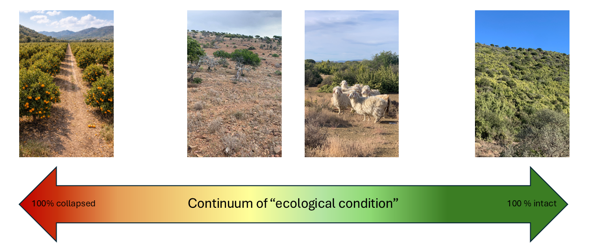

## General Approach

This workflow was developed for the [SBAPP](https://science.uct.ac.za/seec/sbapp-ecological-condition) project to facilitate efficient assessment of ecosystem condition within the project timeline. There are numerous ways to approach this problem, but our workflow provides a consistent way to map ecosystem condition across diverse biomes, while still allowing indicators and remote-sensing metrics that are context dependent and make ecological sense for that system. It is designed to support ecosystem risk assessment (e.g., RLE criteria focused on degradation and biotic disruption), ecosystem accounting (e.g., repeated measures relative to a reference condition), as well as protected area and restoration prioritisation.

A growing range of models and tools for estimating ecosystem condition with satellite data has emerged over the past decade and continues to evolve rapidly. Although most biophysical models were not designed specifically for condition assessment, many produce outputs that can be used directly or adapted for this purpose. However, because the field is broad and methods vary, there is no single, widely accepted guide on which tools and platforms to use. Synthesising guidance from applied use cases, such as [ecosystem accounting](https://seea.un.org/ecosystem-accounting)[@edens2022], and the [Red List of Ecosystems](https://iucnrle.org/), helps clarify the requirements for robust ecosystem condition assessment and highlights emerging best practices[@nicholsonthomas2025].

Ecosystem condition is interpreted as a **continuum** from transformed to intact (Fig. 1), rather than a set of rigid categories.

## What makes this approach different?

We combine expert knowledge with remote sensing data. Many attempts to map ecosystem condition either (a) map *pressures* (e.g., human modification), or (b) map *ecosystem properties* (structure/function) without diagnosing which pressures matter most in a particular ecosystem. We use a **hybrid** approach by first identifying key pressures and how they change ecosystems and then choose indicators and remote-sensing metrics that can realistically detect those changes. We iteratively validate and refine with expert review and (where possible) field evidence.

## The general workflow

{width="775"}

### Step 1 — Define assessment units and identify relevant experts

Choose ecologically meaningful units (e.g., ecosystem types or ecosystem functional groups) and involve experts who can co-define reference ecosystem condition, key pressures, and interpret indicators. Effective ecosystem condition assessments require both (i) an ecologically meaningful typology of assessment units and (ii) a spatial map of those units (their current and/or potential extent).

In South Africa, we use the [National Vegetation Map 2024](https://bgis.sanbi.org/vegmap) as the ecosystem map and typology, with ecosystem types hierarchically nested within bioregions and then biomes. In countries where such a product does not yet exist, the [Global Ecosystem Typology](https://global-ecosystems.org/) and associated [Global Ecosystem Atlas](https://globalecosystemsatlas.org/) provide an ideal starting point as the typology and map for this workflow, with ecosystems (at level 5) nested hierarchically within realms at the top, biomes below that and ecosystem functional groups at level 3 and regional subgroups at level 4. South African bioregions may be cross referenced to GET level 3 or 4, depending on the biome.

### Step 2 — Identify key pressures and change pathways

Screen threats using the [IUCN Threat Classification Scheme](https://www.iucnredlist.org/resources/threat-classification-scheme) ([Fig. 2](#fig1)) to identify the main pressures in the assessment unit. In South Africa the South African National Land Cover or other global land cover products already capture outright transformation by the key habitat loss drivers: crop production, urban development, plantations and mining[@skowno2021]. Our focus targets more subtle degradation within natural land cover classes, such as in rangelands, which are typically driven by land use and other global change drivers such as unsustainable herbivory, invasive species, altered fire regimes, and climate change. The goal is to identify pressure gradients that may be measured with RS data, such as woodiness gradients in grasslands that may represent bush encroachment or invasive woody plant density. that plausibly drive degradation in the unit (e.g., unsustainable herbivory, bush encroachment, invasive plants, altered fire regimes). This step should produce a shared conceptual model of “what changes when the ecosystem degrades?”.

![Figure 2. Key pressures per biome in South Africa, summarised from the full list of pressures in the IUCN Threat Classification Scheme, which include both historical and present pressures. The top rows, represent pressures that can already be measured using national land cover products, while the remaining categories, highlighted by the grey box, still require dedicated data development. Pressures were scored from zero to five, where five represents the most severe impact relative to extent and severity within each biome, while zero represents little to no impact. The scoring of the land cover categories in the top rows was based on the proportion of land covered by each class (see Skowno et al. 2019), while the remainder of classes were calculated as the median score of the authors. Scores are intended as a first-pass, biome-level synthesis. Pressures can vary among ecosystem types or bioregions within a biome. IOCB: Indian Ocean Coastal Belt.](imgs/pressures.png){#fig1}

### Step 3 — Define a reference condition

Define what “intact” (or benchmark) condition means for the unit, ideally across natural variability (seasonality, disturbance/recovery cycles, rainfall gradients). Reference sites should be documented and defensible. We start by developing conceptual theoretical models (Fig. 3) for each bioregion in a biome, which helps to interpret and identify the ecological drivers of different stable states, to differentiate intact vegetation states from degraded states.

{width="799"}

### Step 4 — Select ecosystem-specific indicators of condition

Translate ecological understanding into measurable indicators (structure/function and, where feasibl, composition). Choose a small, defensible set of indicators that reflects how the focal ecosystem works (key structures and processes, and composition where feasible), and that can plausibly shift along the expected degradation or recovery pathways. A practical way to do this is to start from a conceptual ecosystem or bioregion model (Step 3), then map each major pressure (Step 2) to (i) a mechanism (what changes first), (ii) a measurable symptom, and (iii) an indicator that is sensitive, interpretable, and scalable (with a clear direction of change)[@rowland2018]. Reviews of ecosystem-condition indicator practice show that most applications converge on structural and functional indicators (e.g., vegetation cover/biomass/height, fragmentation, fire or flooding regimes, productivity/phenology stability)[@nicholsonthomas2025a], while compositional indicators are often more data-limited and used where suitable proxies[@clements2026] or monitoring data exist.

There are numerous resources available to assist with indicator selection (see Key Resources below).

### Step 5 — Choose remote-sensing metrics and data sources

Select Earth-observation data and derived metrics that can actually detect (at the right grain and frequency) the indicators chosen in Step 4, prioritising time-series approaches wherever condition is expressed as departures from normal dynamics rather than single-date states. Guidance from ecosystem assessment frameworks emphasises making sensor and metric choices deductively and *a priori* from the conceptual model: match each indicator to the most appropriate observation type (e.g., optical indices for greenness and phenology; SAR for structure and moisture sensitivity; thermal for surface energy stress; fragmentation metrics from classified land cover)[@rowland2018a][@murray2018], then test whether the signal is separable from climate-driven variability and observation noise. Recent syntheses[@nicholsonthomas2025b] on ecosystem-condition monitoring also highlight the value of combining complementary datasets (multi-sensor, multi-resolution) and using robust summaries (seasonal metrics, anomalies relative to local baselines, trajectory and breakpoint measures), with validation against field or very-high-resolution reference data wherever possible, because many remote-sensing products were not built “for condition” but can be adapted effectively when the link to ecosystem processes is explicit and uncertainty is carried through the workflow.

------------------------------------------------------------------------

## Two complementary mapping approaches(used in Step 5)

::: callout-note
### A) Deviation-from-reference

This approach treats ecosystem condition as distance from an intact benchmark. We first define reference sites (or a reference “envelope”) that represent the desired state for a given ecosystem type and environmental setting (see e.g. [@harwood2016a], then quantify how far each pixel or sampling unit deviates from the reference spectral, phenological, structural, geospatial or embedding signature. The output is typically a continuous, spatially explicit “severity” surface that is easy to interpret and communicate (higher deviation = lower condition), and can be stratified by ecosystem functional group to avoid confounding natural variation with degradation. As a simple example, ff overgrazing is the dominant pressures in a landscape, and it leads to consistent loss in perennial vegetation cover beyond the natural seasonal varaition, deviation in NDVI from sustainable grazed intact sites may be calculated. It is especially useful where clear intact reference areas exist and where you want transparency over complex model behaviour, but it depends heavily on good reference selection and careful handling of climate/seasonality effects in highly seasonal or disturbance-driven ecosystems.

The [Habitat Condition Assessment System](https://research.csiro.au/biodiversity-knowledge/projects/hcas/) for Australia is good example of such an approach (see Harwood et al. 2016), where habitats that occur in similar abiotic conditions, should have similar spectral signatures, and if not, the difference may be due to non-natural disturbance and thus a difference in habitat condition. Condition is then estimated as the deviation from those expected “intact” signatures within comparable environments, where larger deviations indicate lower habitat condition for biodiversity. This type of approach does not specifically focus on key pressures (e.g. invasive species), but rather overall habitat condition.

### B) Spatial modelling (predictive)

Spatial modelling learns empirical relationships between remotely sensed predictors (e.g., time-series indices, SAR structure proxies, texture, disturbance metrics) plus environmental covariates (e.g., rainfall, soils, topography) and training labels that represent condition (field scores, expert points, or mapped degradation classes)[@bell2021][@sengani]. Models such as random forests can capture non-linear interactions associated with degradation states, extrapolate across large areas, and integrate multiple pressure signals into a single prediction, often with internal validation and variable-importance diagnostics. This approach is powerful when training data are reasonably representative and you need prediction beyond the sampled footprint, but it can be less interpretable than reference-based methods and is sensitive to biased training data, leakage of land-use proxies, and non-stationarity (e.g., climate-driven shifts that change relationships over time).
:::

In practice, the approaches pair well. Reference-based deviation surfaces can guide training design and provide an interpretable baseline, while predictive models can improve coverage and integrate multiple indicators, provided appropriate ecosystem stratification, validation, and uncertainty reporting is applied.

------------------------------------------------------------------------

### Step 6 — Set thresholds and produce ecosystem condition maps

We recommend producing continuous, spatially explicit severity surfaces (e.g., per pixel or sampling unit), and only converting these to categories when reporting requirements make this necessary. Following the RLE guidelines, continuous measures can be calibrated to relative severity by expressing change proportionally along a gradient from a defined reference state (low severity) toward a defined collapsed state (high severity), and then summarised as the proportion of the ecosystem’s distribution that exceeds specified severity thresholds. For instance, woody cover can be mapped as a continuous fractional cover layer[@venter2018], with severity represented as increasing departure from reference woody cover (e.g., near-zero in intact grassland). Where thresholds are needed, these continuous surfaces can be reclassified into severity bands using ecologically defensible breakpoints (e.g., cover levels linked to reduced herbaceous biomass or shifts in fire behaviour), ideally grounded in expert knowledge and supported by state-and-transition models rather than arbitrary statistical cut-offs.

## Known challenges

-   **Natural variability vs degradation**: seasonal cycles, rainfall variability, fire recovery and disturbance history can mimic degradation signals. We prefer time-series and phenology metrics and interpret everything relative to reference expectations.
-   **Unit definition matters**: if the ecosystem unit is mapped too broadly, condition signals get blurred. We document the chosen units and revise if experts disagree.
-   **Remote sensing is proxy-based**: we lean heavily on expert interpretation and transparent assumptions, and we treat uncertainty as a first-class output.

------------------------------------------------------------------------

## References

::: {#refs}
:::
