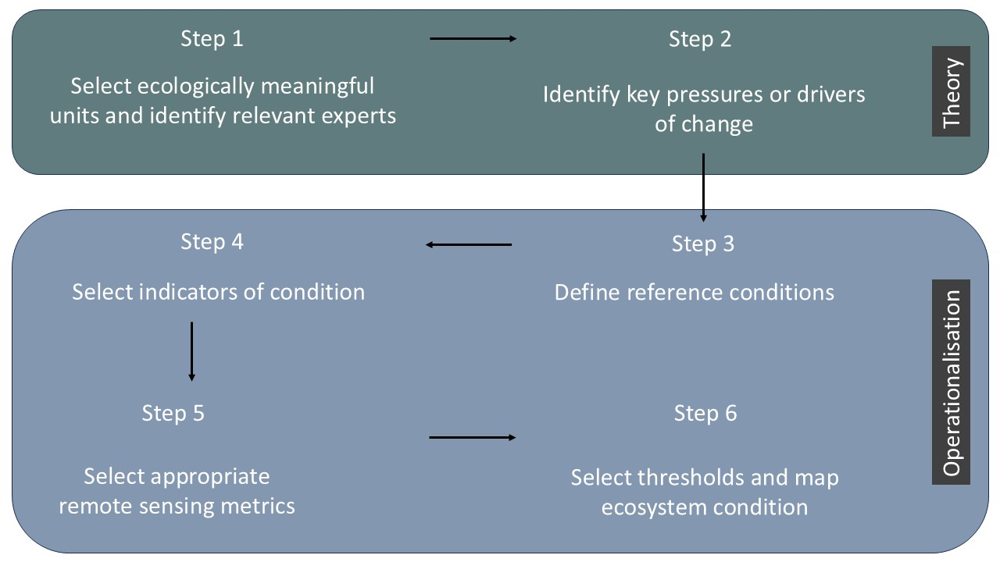

## General Approach

This workflow was developed for the SBAPP project to facilitate efficient assessment of ecosystem condition within the project timeline. There are numerous ways to approach this probem, but our workflow provides a consistent way to map ecosystem condition across South Africa’s diverse biomes, while still allowing each biome to use indicators and remote-sensing metrics that are context dependent and make ecological sense for that system. It is designed to support ecosystem risk assessment (e.g., Red List of Ecosystems criteria focused on degradation and biotic disruption), ecosystem accounting (e.g., repeated measures relative to a reference condition), as well as protected area and restoration prioritisation (end-user maps).

A growing range of models and tools for estimating ecosystem condition has emerged over the past decade and continues to evolve rapidly. Although most biophysical models were not designed specifically for condition assessment, many produce outputs that can be used directly or adapted for this purpose. However, because the field is broad and methods vary by context, there is no single, widely accepted guide on which tools and platforms to use. Synthesising guidance from applied use cases, such as ecosystem accounting (SEEA EA), and the IUCN Red List of Ecosystems (RLE), helps clarify the requirements for robust condition assessment and highlights emerging best practices.

## The general workflow

{width="775"}

### Step 1 — Define assessment units and identify relevant experts

Choose ecologically meaningful units (e.g., ecosystem types or functional groups) and involve experts who can co-define reference condition, key pressures, and interpret indicators.

### Step 2 — Identify key pressures and change pathways

Screen threats using the [IUCN Threat Classification Scheme](https://www.iucnredlist.org/resources/threat-classification-scheme) ([Fig. 1](#fig1)) to identify the main pressures that plausibly drive degradation in the unit (e.g., unsustainable herbivory, bush encroachment, invasive plants, altered fire regimes). This step should produce a shared conceptual model of “what changes when the ecosystem degrades?”.

![Figure 1. Key pressures per biome in South Africa, summarised from the full list of pressures in the IUCN Threat Classification Scheme, which include both historical and present pressures. The top rows, represent pressures that can already be measured using national land cover products, while the remaining categories, highlighted by the grey box, still require dedicated data development. Pressures were scored from zero to five, where five represents the most severe impact relative to extent and severity within each biome, while zero represents little to no impact. The scoring of the land cover categories in the top rows was based on the proportion of land covered by each class (see Skowno et al. 2019), while the remainder of classes were calculated as the median score of the authors. Scores are intended as a first-pass, biome-level synthesis. Pressures can vary among ecosystem types or bioregions within a biome. IOCB: Indian Ocean Coastal Belt.](imgs/pressures.png){#fig1}

### Step 3 — Define a reference condition

Define what “intact” (or benchmark) condition means for the unit, ideally across natural variability (seasonality, disturbance/recovery cycles, rainfall gradients). Reference sites should be documented and defensible. Conceptual theoretical models in each bioregion helps to interpret and identify the ecological drivers of different stable states, to differentiate intact vegetation states from degraded states.

### Step 4 — Select ecosystem-specific indicators of condition

Translate ecological understanding into measurable indicators (structure/function and—where feasible—composition). Indicators should be linked to the pressures in Step 2 and be interpretable to end users.

### Step 5 — Choose remote-sensing metrics and data sources

A growing range of models and tools for estimating ecosystem condition has emerged over the past decade and continues to evolve rapidly. Although most biophysical models were not designed specifically for quantifying ecosystem condition, many generate outputs that can be applied directly or readily adapted for that purpose. Clear guidance on which tools and modelling platforms to use in ecosystem condition quanitification is not yet available, given the breath of the topic. Bringing together the guidance from specific use cases such as how ecosystem condition is used in ecosystem accounts and in the RLE, improves the understanding of the requirements and best practices.

Select satellite/sensor data and metrics that are capable of detecting the chosen indicators at appropriate spatial and temporal scales. Time-series and phenology-based measures are often essential in seasonal systems.

### Step 6 — Set thresholds and produce ecosystem condition maps

Even if condition is mapped continuously, many applications require severity classes (e.g., intact / moderate / severe). Thresholds should be guided by the metric distributions, expert definitions, and (where available) state-and-transition understanding. Generate spatial outputs, validate against field/expert evidence, quantify uncertainty, and iterate with expert review until the product is ecologically defensible. Outputs can be continuous (0–1) or categorical depending on the use case.

------------------------------------------------------------------------

## Two complementary mapping approaches (used in Step 5)

::: callout-note
### A) Deviation-from-reference (reference-based)

A simple, interpretable approach which quantifies departures from intact spectral/phenological signatures, either observed or modelled.
:::

::: callout-note
### B) Spatial modelling (predictive)

Spatial modelling approaches (e.g., random forests) learn relationships between RS predictors, environmental covariates, and training data representing ecosystem condition or land degradation (Bell et al., 2023; Sengani et al., 2025; Symeonakis and Higginbottom, 2014)
:::

Both approaches can be appropriate; we generally choose based on data availability, the ecosystem, pressure signals, training data availability, and interpretability requirements.

------------------------------------------------------------------------

## Known challenges

-   **Natural variability vs degradation**: seasonal cycles, rainfall variability, fire recovery and disturbance history can mimic degradation signals. We prefer time-series and phenology metrics and interpret everything relative to reference expectations.
-   **Unit definition matters**: if the ecosystem unit is mapped too broadly, condition signals get blurred. We document the chosen units and revise if experts disagree.
-   **Remote sensing is proxy-based**: we lean heavily on expert interpretation and transparent assumptions, and we treat uncertainty as a first-class output.

------------------------------------------------------------------------

## Key resources

The UN SEEA EA provides substantial resources for guiding biophysical modelling for ecosystem accounts. Readers are referred to the following resources for guidance on approaches to assess ecosystem condition:

## 
