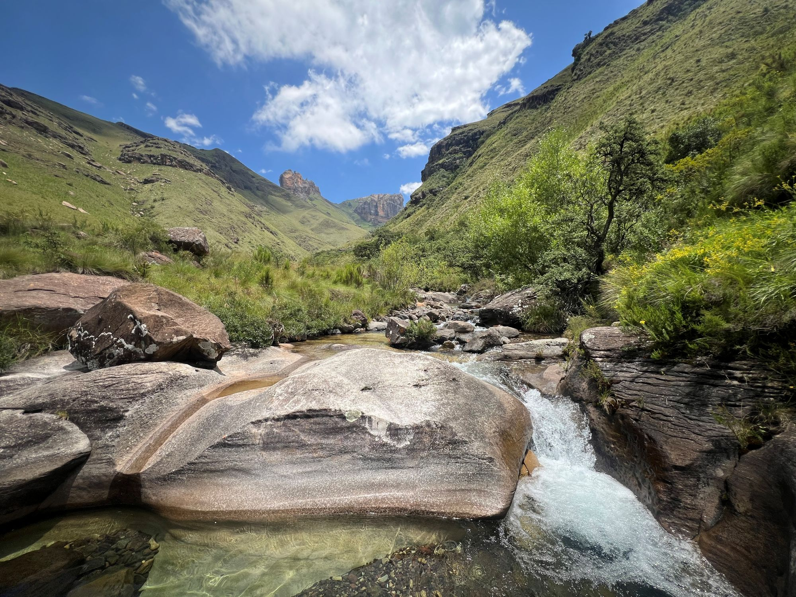
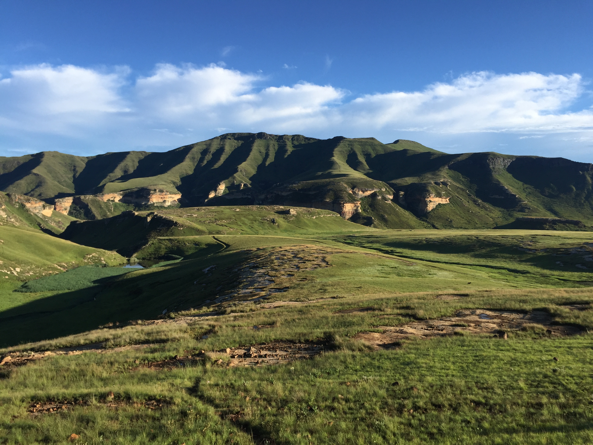

Welcome to the Ecosystem Condition website. This resource provides information, and case studies about how we assess ecological condition in South Africa's diverse biomes.

{width="692"}

### Why ecosystem condition matters

Ecosystem condition describes how an ecosystem’s structure, composition and functioning compare to a reference state, and how pressures are altering that state through time. Condition information supports restoration prioritisation, tracking degradation and recovery, and transparent reporting against national and global biodiversity and land degradation targets.

::: grid
::: g-col-4
### [Overview](content/overview/index.qmd)

Understand the scope, definitions, and key concepts of ecosystem condition.

{width="648"}
:::

::: g-col-4
### [Workflow](content/workflow/index.qmd)

Explore the general approach and analytical steps used in the assessments.

{width="634"}
:::

::: g-col-4
### [Biomes](content/thicket/index.qmd)

Explore how we approach ecosystem condition assessments in specific biomes or case studies.

{width="634"}
:::
:::

### Featured case studies

[Albany Thicket](content/thicket/index.qmd) – Structurally complex evergreen vegetation where degradation follows a relatively clear state and transition model compared to more disturbance-driven vegetation such as Grassland.

[Nama Karoo](content/nama_karoo/index.qmd) – Natural bare ground in the Nama Karoo complicates degradation detection. Separating drought effects and natural bare ground cover from degradation is essential.

### 

::: callout-note
This is a living resource and will be updated as information becomes available. While the content for this website is collated and edited by Stephni van der Merwe, many researchers contributed to content creation and are cited in each page. The views expressed are not necessarily those of the affiliated institutions.
:::
